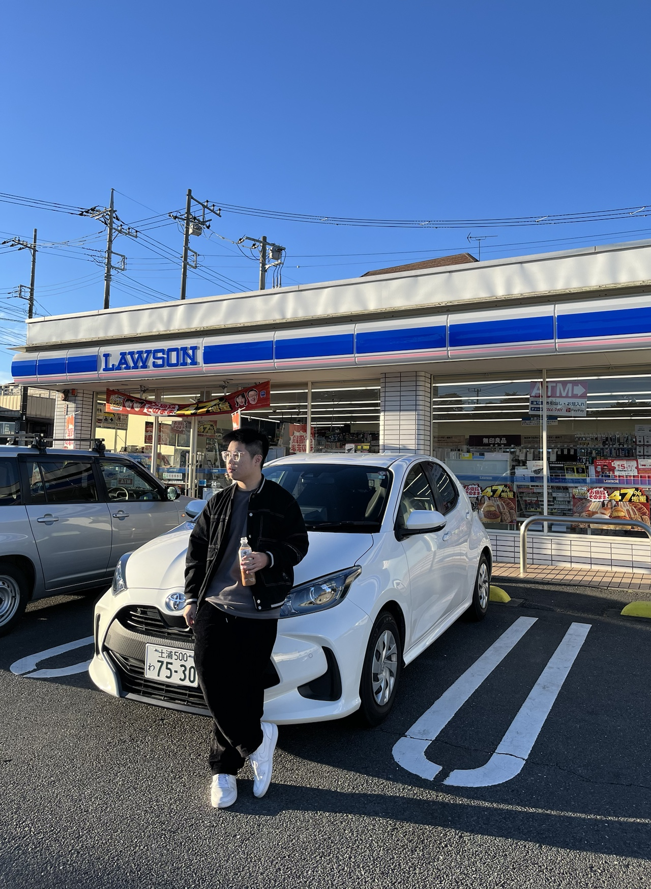

  

    <h1>歡迎</h1>
    
我是 Jabee 姜，目前就讀中原資工！是個基督徒～

    
認真來講，我超愛資工系，我真的很愛學各種電腦的技術、新知。但人生不只寫code，還有很多可以去學、去探索的地方。

    
所以除了電腦科學相關的，在這個 Blog 裡面，我還會分享我旅遊的經驗，騎重機的經驗，我的所見所聞，甚至於日常瑣事的閒聊，期待用這個 Blog 記錄自己的人生。

    <h2>我的興趣</h2>
    <ul>
      <li>攝影</li>
      <li>旅遊</li>
      <li>看各種yt影片（中文、非中文）</li>
      <li>組電腦</li>
      <li>還有太多了xd</li>
    </ul>
  

  

    
  

# Contact me

Email : james930228[at]gmail.com

Github：[https://github.com/jabee0228](https://github.com/jabee0228)

Linkedin：[https://www.linkedin.com/in/jameschiang0228/](https://www.linkedin.com/in/jameschiang0228/)

期待身為讀者你的來信！

## 關於我的文章

- [我平常會使用的應用程式](/notes/241121/)
- [我平常會看的 YouTuber 和 B站博主](/notes/241214/)

 

 

  <!-- Experience -->  

  <h2 style="; border-bottom:2px solid #eee; padding-bottom:.3rem;">🧑‍💼 Experience</h2>
  

    

      <h3 style="margin:0; color:#0d6efd; font-size:1.1rem;">Associate Software Developer</h3>
      
Chung Yuan Christian University · Contract

      
May 2025 – Present · 5 mos · Zhongli, Taoyuan 

    

    

      <h3 style="margin:0; color:#0d6efd; font-size:1.1rem;">Machine Learning Research Intern</h3>
      
Academia Sinica · Internship

      
Jul 2025 – Aug 2025 · 2 mos · Taipei, Taiwan 

    

  
 

 <!-- Projects -->

  <h2 style=" border-bottom:2px solid #eee; padding-bottom:.3rem;">💻 Projects</h2>

  <h3 style="margin-top:1rem; color:#0d6efd; font-size:1.05rem;">Active</h3>

  

    

      

DailyClassical

      
 2025 - Present        IOS、Android，每日一篇古典樂相關介紹（測試中，預計 2025 Q4 上市，官網建置中）

    

  

  

    

      

  <a href="https://github.com/jabee0228/SubtitleLLM" style="text-decoration:none; color:inherit;">SubtitleLLM</a>

      
 2025 - Present        An intelligent automatic video subtitle generation system that combines OpenAI Whisper speech recognition with LLM correction for high-quality subtitle creation.

    

  

  <h3 style="margin-top:1rem; color:#0d6efd; font-size:1.05rem;">Discontinued</h3>
  

    

      

  <a href="https://github.com/jabee0228/PerspectiveFill" style="text-decoration:none; color:inherit;">PerspectiveFill</a>

      
2024 - 2025   Image Inpainting Methods via Various Perspective Image Synthesis

    

  

  

    

      

  <a href="https://github.com/jabee0228/BestYTBot-Discord
" style="text-decoration:none; color:inherit;">BestYTBot-Discord
</a>

      
2025   Play Youtube on Discord 

    

  

  

    

      

  <a href="https://github.com/jabee0228/CYCU-ICE-PL-INTERPRETER
" style="text-decoration:none; color:inherit;">Scheme Interpreter
</a>

      
2025   Our-Scheme Interpreter source code 

    

  

  <!-- Publication -->
  <h2 style="border-bottom:2px solid #eee; padding-bottom:.3rem;">📚 Publication</h2>
  

    

      
A Study of Image Inpainting Methods via Various Perspective Image Synthesis Using CNN-based and Diffusion-based Models

      
En Chen (陳恩), Yi-Hsin Chiang (姜義新), Chih-Chang Yu (余執彰), Hsu-Yung Cheng(鄭旭詠)

      
The 38th Conference on Computer Vision, Graphics, and Image Processing (CVGIP 2025), August 2025.

    

  

</section>

