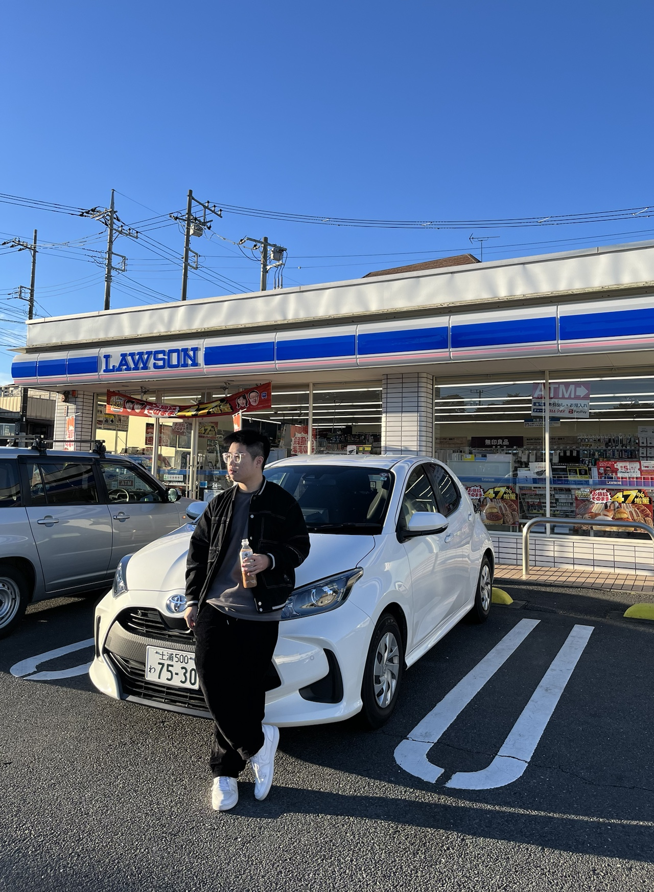

  

    <h1>歡迎</h1>
    
我是 Jabee 姜，目前就讀中原資工！是個基督徒～

    
認真來講，我超愛資工系，我真的很愛學各種電腦的技術、新知。但人生不只寫code，還有很多可以去學、去探索的地方。

    
所以除了電腦科學相關的，在這個 Blog 裡面，我還會分享我旅遊的經驗，騎重機的經驗，我的所見所聞，甚至於日常瑣事的閒聊，期待用這個 Blog 記錄自己的人生。

    <h2>我的興趣</h2>
    <ul>
      <li>攝影</li>
      <li>旅遊</li>
      <li>看各種yt影片（中文、非中文）</li>
      <li>組電腦</li>
      <li>還有太多了xd</li>
    </ul>
  

  

    
  

# Contact me

Email : jabee[at]jabee.net

Github：[https://github.com/jabee0228](https://github.com/jabee0228)

Linkedin：[https://www.linkedin.com/in/jameschiang0228/](https://www.linkedin.com/in/jameschiang0228/)

期待身為讀者你的來信！

## 關於我的文章

- [我平常會使用的應用程式](/notes/241121/)
- [我平常會看的 YouTuber 和 B站博主](/notes/241214/)

 

 

<!-- Education -->

  <h2 class="resume-section-title">🎓 Education</h2>
  
  

    

      
      <h3 class="resume-edu-school">National Chung Cheng University</h3>
      

      
Master of Engineering - MEng, Computer Science and Information Engineering

      
Sep 2026 – Jun 2028

  

  
  

    

      
      <h3 class="resume-edu-school">Chung Yuan Christian University</h3>
    

    
Bachelor of Engineering - BE, Information and Computer Engineering

    
Sep 2022 – Jun 2026

  

<!-- Experience -->  

  <h2 class="resume-section-title">🧑‍💼 Experience</h2>
  

    <h3 class="resume-item-title">Associate Software Developer</h3>
    
Chung Yuan Christian University · Contract

    
May 2025 – Jan 2026 · 9 mos · Zhongli, Taoyuan

  

  

    <h3 class="resume-item-title">Machine Learning Research Intern</h3>
    
Academia Sinica · Internship

    
Jul 2025 – Aug 2025 · 2 mos · Taipei, Taiwan

  

<!-- Projects -->

<h2 class="resume-section-title">💻 Projects</h2>

<h3 class="resume-subsection-title">Active</h3>

Taking a Break

Current Status 
Currently taking a break from active project development to focus on learning and personal growth.

😴 Zzzzzz...

<h3 class="resume-subsection-title">Discontinued</h3>

<a href="https://github.com/jabee0228/SubtitleLLM">SubtitleLLM</a>

2025 
An intelligent automatic video subtitle generation system that combines OpenAI Whisper speech recognition with LLM correction for high-quality subtitle creation.

Python
Whisper

<a href="https://github.com/jabee0228/PerspectiveFill">PerspectiveFill</a>

2024 - 2025 
Image Inpainting Methods via Various Perspective Image Synthesis

Python
TensorFlow
Vue

<a href="https://github.com/jabee0228/CYCU-ICE-PL-INTERPRETER">Scheme Interpreter</a>

2025 
Our-Scheme Interpreter source code

Python
Scheme

<a href="https://github.com/jabee0228/BestYTBot-Discord">BestYTBot-Discord</a>

2025 
Play Youtube on Discord

Python

<!-- Publication -->

  <h2 class="resume-section-title">📚 Publication</h2>
  

    
A Study of Image Inpainting Methods via Various Perspective Image Synthesis Using CNN-based and Diffusion-based Models

    
En Chen (陳恩), Yi-Hsin Chiang (姜義新), Chih-Chang Yu (余執彰), Hsu-Yung Cheng (鄭旭詠)

    
The 38th Conference on Computer Vision, Graphics, and Image Processing (CVGIP 2025), August 2025.

  

</section>
