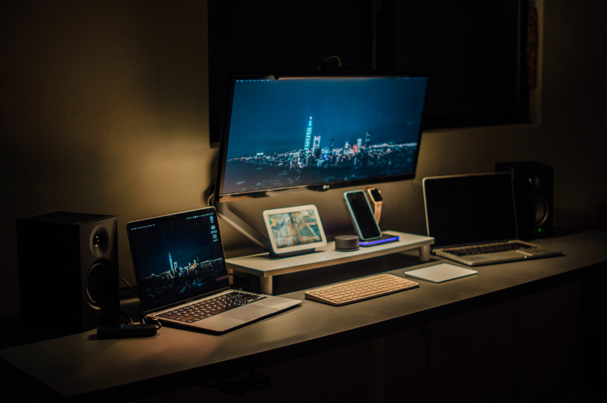

最近科技圈鬧得沸沸揚揚的肯定是新 mini 的開機按鍵，大家一直在吵按鍵坐在那邊要確定誒之類的話，但我完全覺得沒什麼。

# 身為麥金塔老用戶

身為 Mac 6 年老用戶，從 high sierra、mojave 到現今的 Sonoma （還沒更新，我都穩定了才會更新），從黑蘋果一路用到白蘋果，一路用到現在。我可以肯定是，我一年主動的關機次數真的是沒有，大約就是一隻手手指可以數得出來。

## 為什麼都不關機

其實我也不太能理解為什麼要一直關機，macOS 一直以來在休眠表現都相當的好。從很早開始，蘋果就開始使用 NVRAM，確保在斷電之後的重新啟動可以恢復斷電前的狀態。我記得我在一開始使用的時候，這方面讓我讚嘆不已。畢竟，為了省電（尤其是 Laptop ），休眠還是盡可能的做斷電。以我的 m1 MacBook Air 來說，剛拿到全新的時候，最長有試過用5天都還是可以正常使用。即使不關機，我在和同學的電腦對比起來，我從來不用在考試、圖書館沒插座的時候，去擔心沒有電的問題。（反而是我的 iPhone 整天一直沒電真的很躁）

所以如果你還在使用 Windows 筆電，然後每次都要打開來的時候開機，關起來的時候關機，就只是為了省電。我可以保證，在 Mac 不會有這個問題。

另一個層面來想，我真的很討厭，我需要做事的時候，卻要等待開機。用 Mac 回不去的原因就是一個，**這個作業系統整體給我的回應速度是快的**，我永遠不需要去擔心，當我要做事的時候 -> 按下開機鍵 -> 等 20 秒開機進桌面 -> 等待 30 秒一堆開機自起的應用程式 -> 然後再等待 10 秒開啟你要用的程式，然後開始工作（如果今天你用的不是 pcie 的 ssd，那你可能要把時間再加30秒）。 其實你等待的時間，不只是這些時間，因為這些時間還要再加上額外的因為等太久而去滑手機的時間（其實開機好你還是繼續滑手機）。

# 所以為什麼按鍵做在下面

前面解釋了一堆為什麼不關機，其實也就間接解釋了為什麼按鍵做在下面。因為這個作業系統就是希望你有良好的體驗，不是給你要用才開機，用完就關機的。若是你的手機要用才開機，你還不瘋掉？

## 不是只有 Mac mini 這樣設計

其實不止 Mac mini，我有在使用的包含 google nest hub 2、nest mini，都有同樣的設計，更跨張的是，他們甚至沒有開機按鍵，這樣的設計我想就是除了你需要移除裝置之外，不希望你關機。

所以，對我來說，一個好用的作業系統就是要及時、快速，能不耽誤我的工作，目前真的只有 macOS 能滿足我的體驗。
