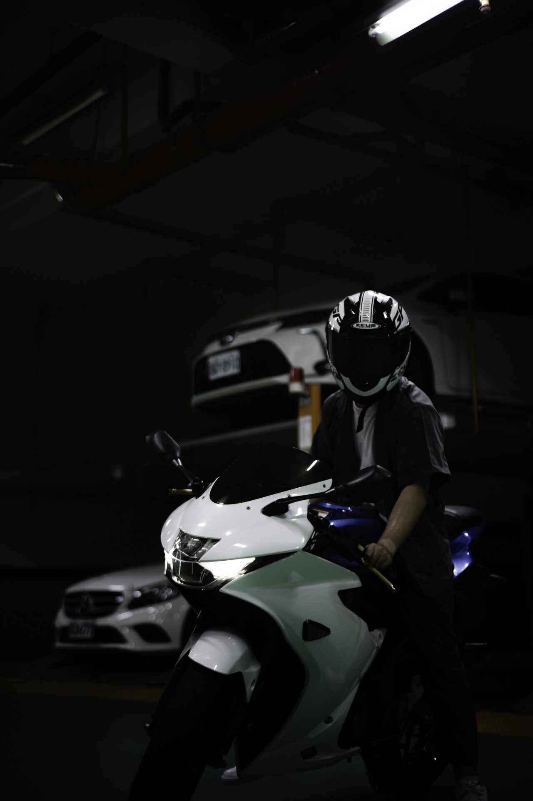
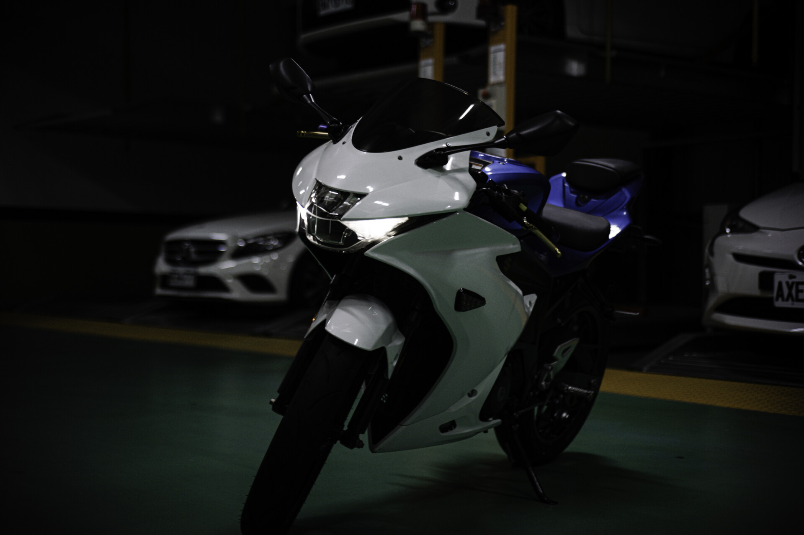
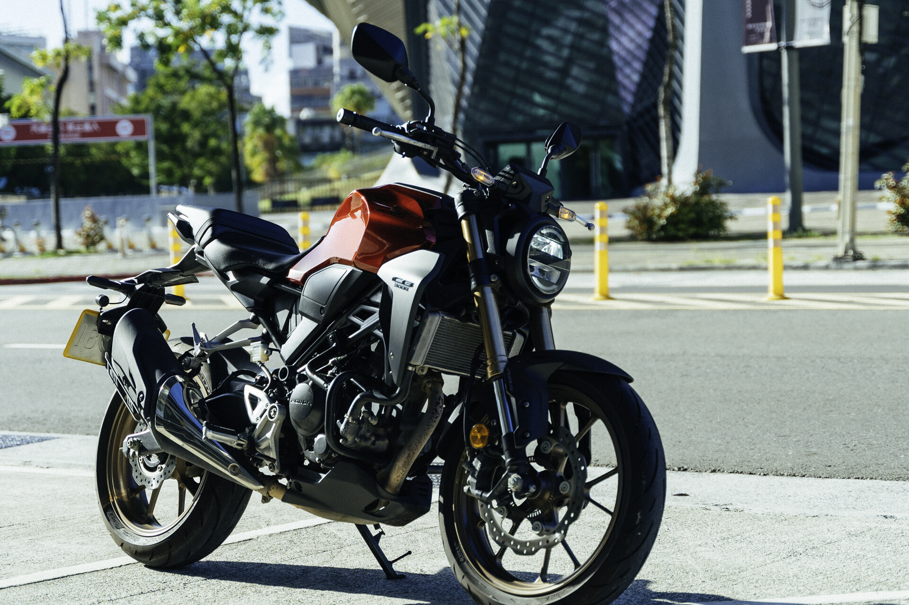
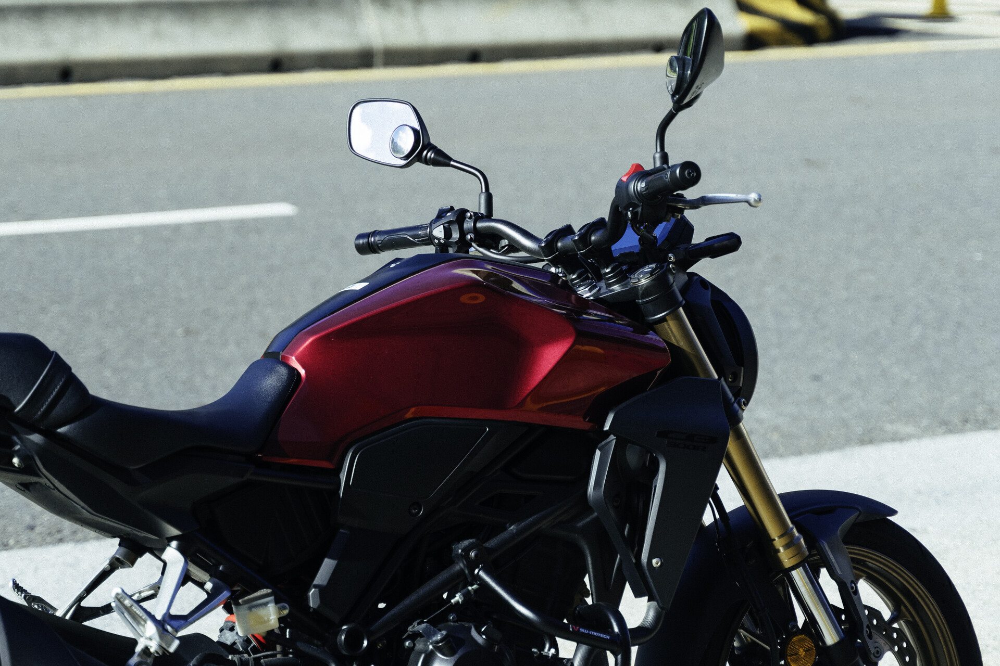

# 拒絕騎速克達

和大部分台灣家庭不同，小時候家裡沒有買摩托車，所以我從小就沒搭過摩托車的經驗。比較有印象的一次是，過年的時候，我爸騎摩托車載我去買麥當勞。

對我來說，我眼裡的速克達都長得差不多，我知道 Yamaha Force、jet 之類的那種摩托車也很貴，但在我眼裡其實長得都差不多，我不喜歡速克達的外觀。反而是檔車，變化多樣，從復古手工車，到一般街車，然後最帥的肯定是仿賽。對我來說，速克達就是交通工具，他一點都不帥。這個概念就像是你應該不會說 toyota vios 很帥，但也不差，因為它是便宜的買菜車。

# 我的第一台車

這個要追朔到高中時期，那時候偶然知道有小阿魯這台車的時候，我就知道，我考到駕照一定會買一台。

第一次看到小阿魯的時候，與其他車不同的小阿魯，中間單燈的造型，看似就如 Moto GP 廠車一樣。

我對於大排量的重機其實沒有到太大的興趣，反而是小阿魯這種輕檔，相當吸引我。雖然我一開始是被 Suzuki 的藍色廠車配色吸引到，對我來說，那個顏色在我心目中就是 Moto GP 的最高級別啊！

後來在挑的時候，雖然沒有挑到廠車的配色（主要是這台不是花車改、就是摔到亂七八糟、車況很難找到好的），但我的這台相當接近原廠，除了腳踏後移等更方便的改裝，而且這台已經改短牌架了，果斷買下這台。

其實我擁有這台車不超過兩個月就被我賣了，但這是在我的計畫中。買這台前，就有先租過一次，那個車況真的是，我還以為車要散掉了，租這種小破車，一次還要1000，根本是盤子才租車吧！所以才會買一台，然後開學前賣掉，因為當時沒有打算騎回學校。

## 檔檔萬轉小阿魯

高中就聽過一個說法：小阿魯就是要 **檔檔萬轉，不到萬轉不換檔**，這個口號跟著我從買車前到買車後。我真的不到萬轉不會換檔，看到儀表到9000轉才去勾檔位。

究竟是不是萬轉動力才會出來？ 我認為真的是。接近萬轉的時候，會感受一股推力，衝擊上來，那個感覺很舒服，**感受到人車一體的感覺**。

如果拉到接近紅線的話，4檔可以時速 9x，動力在 150 以內級距根本是無敵的存在。不要遇到 250 的檔車，我就是待轉區之王！

 

雖然當初的我不敢壓車，所以根本沒辦法跑山，但每天可以看到自己的車，然後去洗車，真的讓我很開心。

# 我的第二台車

另一個會把小阿魯賣掉的原因就是因為我馬上可以考重機駕照了。我真的不能接受，不能騎內線，左轉要去待轉這種事（我保證我沒有一次停進待轉區）。所以我決定考到重機駕照再買一台重機就好了。

如願以償，我在今年的夏天，考到了大型重機駕照，所以我現在要騎 2000cc 的也可以了xd。（有機會再講一篇考重機駕照的心得）

考完後，我就想去租一台騎看看。

但我隨便看，我頭就痛起來。租個一天要2000元，要確定誒，好狠啊。因為租車真的太貴了，所以還是果斷買一台。駕訓班上課的時候偶然知道有一台 BMW g310r，我看這外觀其實我滿喜歡的，但是車子量好少。我偶然在衝浪的時候看到 Mobile01 上面有人說有一天他的 g310r 不能換檔，結果原廠報價要修5萬。我果斷只開始找另一台車。

## Honda CB300r

這個另一台車就是 Honda CB300r，因為我賣掉小阿魯之後就決定要買一台街車，剛好我父親也要一起騎，所以這台車可以說是完美。

單燈的造型，流線的車身，這就是我眼中街車的最高境界！

但事實上，我認為沒有比小阿魯好騎。在騎車方面，因為我把檔檔萬轉這種可怕的習慣帶到這台車上，讓我覺得這台車很沒力，當然 0~100 隨便衝肯定沒問題，但車子比小阿魯排氣量還大，動力卻沒有多到很多，這是小失望的部分。

據我姐夫跟我說（150r），他刷電腦真的很快，但我後來想了一下，我其實平常也騎不快，似乎就不用改這個了。

因為這個真的很大台，移車起來也很不方便。但騎著他我真的很快樂，上個月騎車的時候，遇到 Rabel 車友，車友還跟我按喇叭比讚，我也跟他比讚，真的好開心啊！

# 但缺點也許比優點多

和大部分騎檔車的人不同，我沒有什麼 *覺得換檔才有騎車開車的感覺* ，真的沒有。

