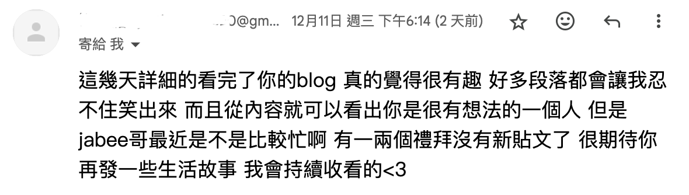

# 為什麼這麼久沒更新？

上上上個星期開始，Jabee我被同學傳染，因此開始喉嚨痛。每天吃藥，都很想睡覺，實在無力動動手指，打開電腦。原本想著好了就可以繼續更新了。哪知來了個大的感冒，喉嚨痛剛好，給我來個腸胃炎，每天一直拉肚子，肚子超痛。後來還去大醫院看醫生，本週身體終於稍微恢復。

另外本週還收到讀者的來信，很開心有人持續在追蹤我的 Blog，Jabee覺得讀者過獎了，是大家不嫌棄，能有一個地方發表自己的想法才是我開 Blog 的最初目的，Jabee我會努力寫文章的xd。

## 在感冒和考試中夾殺

本週，還考了一個很重要的考試，通常這個考試我都會準備 4~5 天，因為光把書書讀懂，大概會花一到兩天的時間，然後六日一沒有上課，我就會全力衝刺準備考試。但這次我從星期日早上開始讀，而且兩天都沒有很認真讀書。可以算是大學以來，少數我沒有準備完全就上去考試。不過，剛好讀的都有考，雖然也不保證都對，但至少不會太差，也算是小確幸。

希望接下來我會繼續努力更新鴨！

