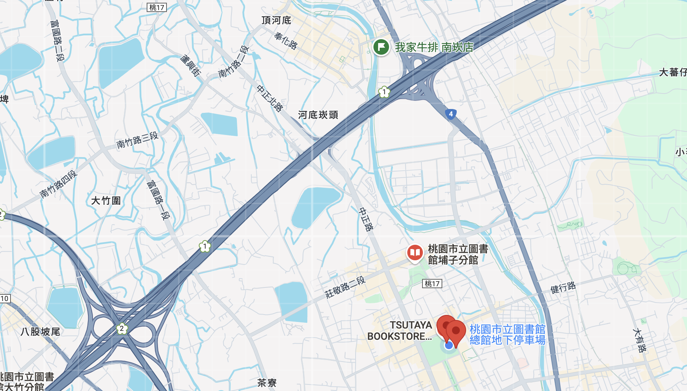
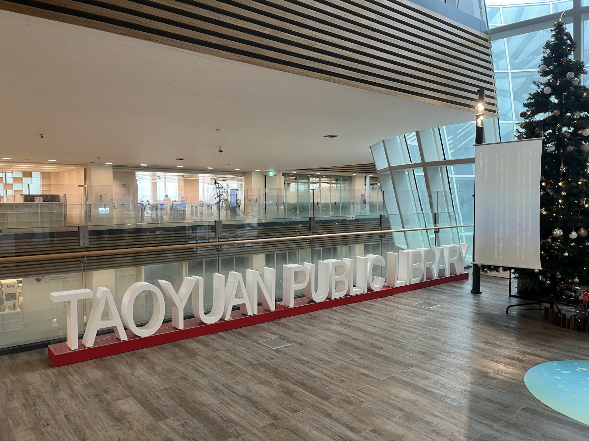
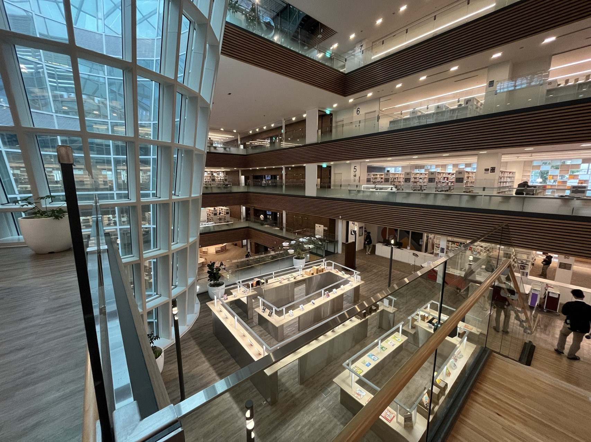
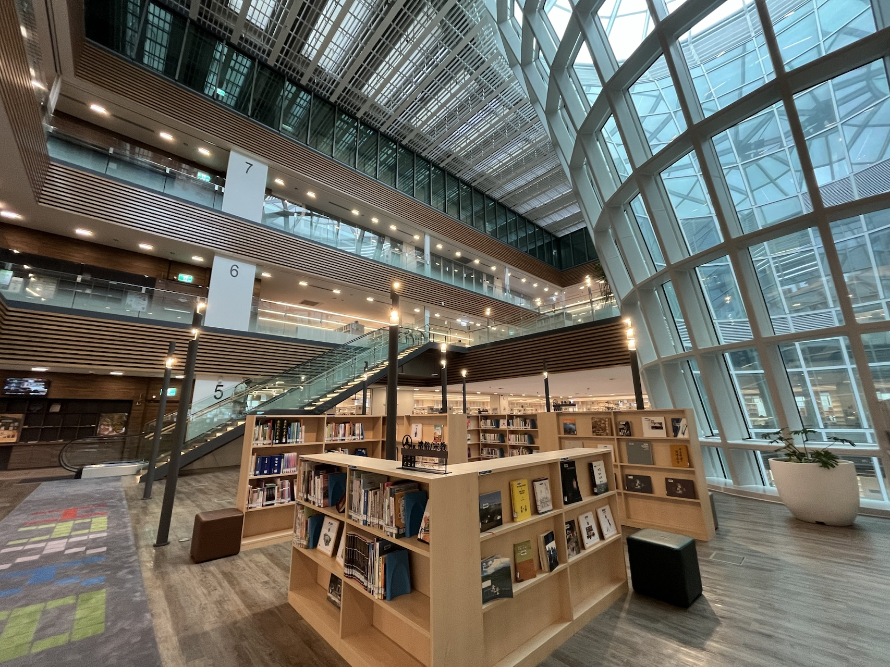
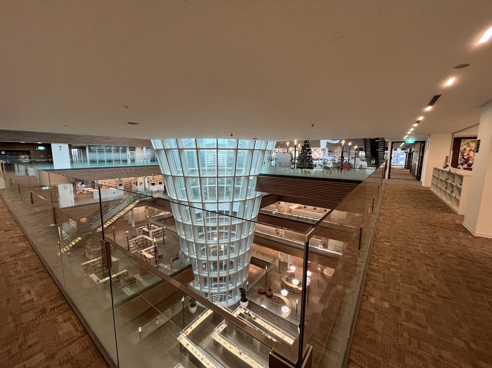
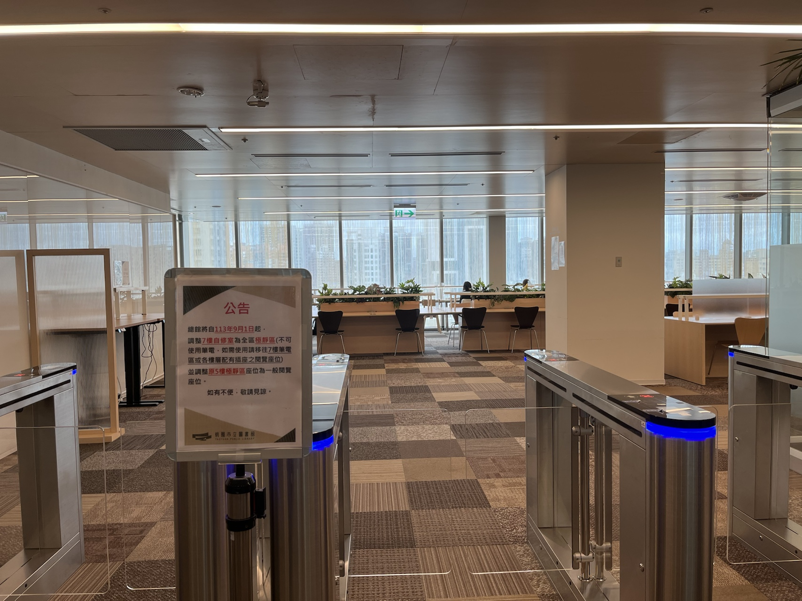
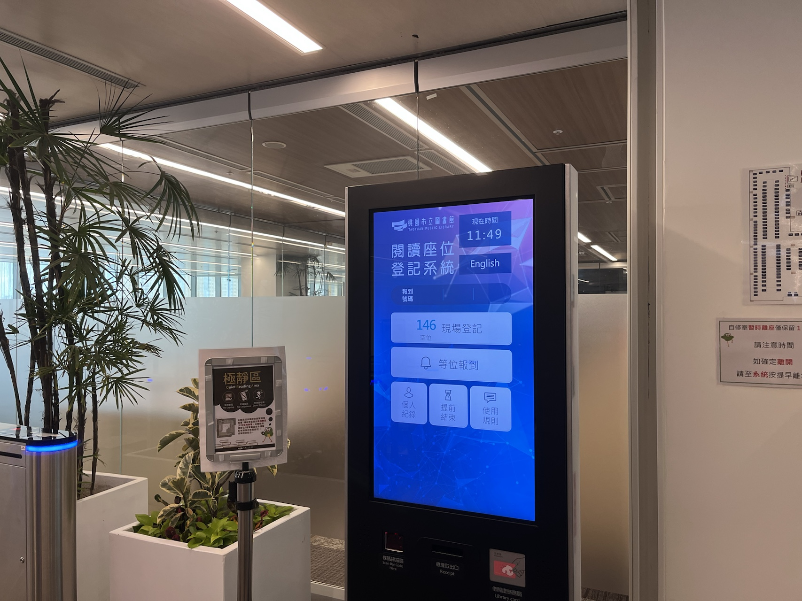
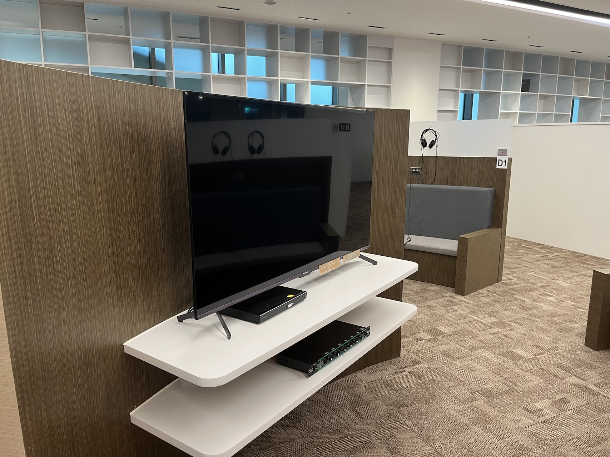
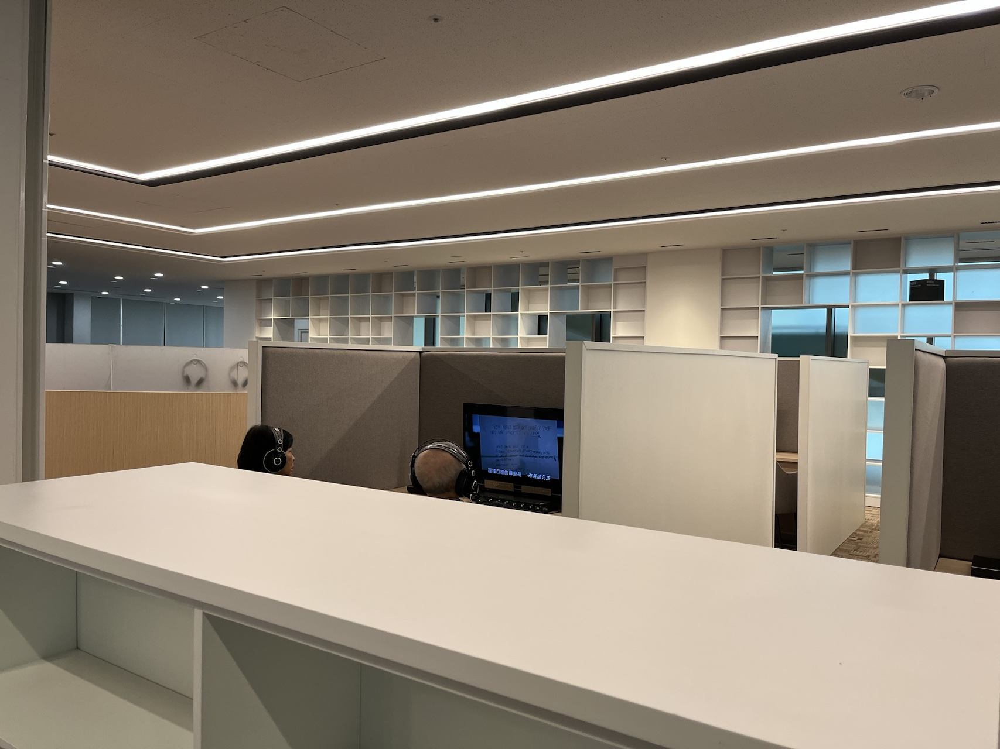

今天是 12/24 ，平安夜學校放假，因此我沒有圖書館去，剛好堂弟也沒事，所以就和他一起去桃園圖書館。

剛開的時候就知道不錯，但一直沒時間去看看，趁著今天去看一下。

# 地理位置

桃園圖書館總館位於桃園藝文特區，如果開車去的話很方便，走國道一號桃園交流道下來就可以到。不塞車的話，我們從從中壢火車站開車 20 分鐘就到了，但如果騎車去的話就不是很方便了。

另外地下室也有地下停車場（汽車、摩托車），不確定位子假日會不會不夠，因為光平日B1就完全停滿。另外，好像沒有看到大型重機的停車位，也許可以直接停摩托車車位。（自從買重機之後就會注意有沒有重機的位子）

# 整棟空間

整個園區大致分為兩棟，一棟為圖書館，另一棟為電影院。

## TSUTAYA BOOKSTORE

令我意外的是，在圖書館的那一棟，一樓竟然設有 TSUTAYA BOOKSTORE ， 一開始我還想說都已經來圖書館了，誰還去要花錢的 TSUTAYA 啊 xd ！

不過是我膚淺了，後來才想起來，圖書館不能喝飲料啊！ 所以 TSUTAYA 應該還是有他的客群。

# 圖書館

二樓以上就是桃園圖書館總館了，總共分為 6 個樓層，為 2-7 層樓。整棟真的滿大的，大概是中原圖書館的兩倍大。

## 2-6 樓

2-5樓是一般的圖書區，然後旁邊就會設有很多的桌椅，有一半是有插座的，另一半則是沒有插座。自己個人體驗相當好啊，明亮度也相當足夠，也足夠安靜。

天井設計真的挺美的，整體的動線設計也挺清晰的，在建築美學和動線上的平衡我認為相當不錯。

整棟也有配備電梯，並且工作人員電梯還民眾的電梯分開。







## 7樓

7樓就比較特別一點了，有極靜區和電影區。從 7 樓看下去也相當的美。

### 極靜區

這裡規定要相當安靜，意思就是不能使用筆電，而且有人數控管，需要登記才能進去，不知道非桃園戶籍，用學生證可不可以登記，因為我要用電腦，就沒有使用這區。

### 電影區

這邊有超多電影位子，有 27 寸的電視，看過去大概有50個位子左右，然後 50 寸的大電視 3 台左右，32寸的電視也大概有10台。（以上為預估，我不是很會看電視尺寸）每一電視都配有耳擴和耳機，根據電視大小，耳擴可接的耳機數量也不一樣，最大的電視有 6 個耳機。

不過可惜這裡沒有聽音樂的區，我繞了一圈沒看到（不確定是不是就是在電影區用耳擴聽）。

# 營業時間

| 星期二 | 08:30–21:00 |
| :----- | ----------- |
| 星期三 | 08:30–21:00 |
| 星期四 | 休息        |
| 星期五 | 08:30–21:00 |
| 星期六 | 08:30–21:00 |
| 星期日 | 08:30–17:00 |
| 星期一 | 08:30–17:00 |
