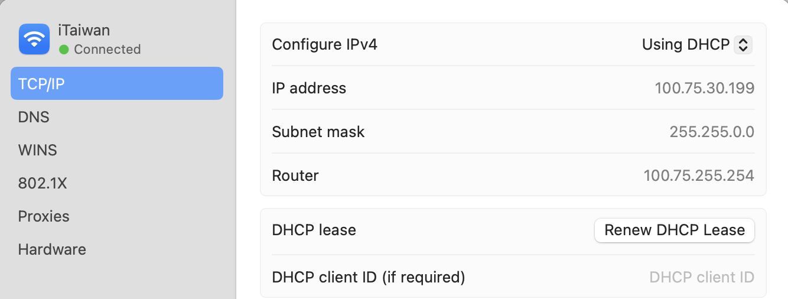
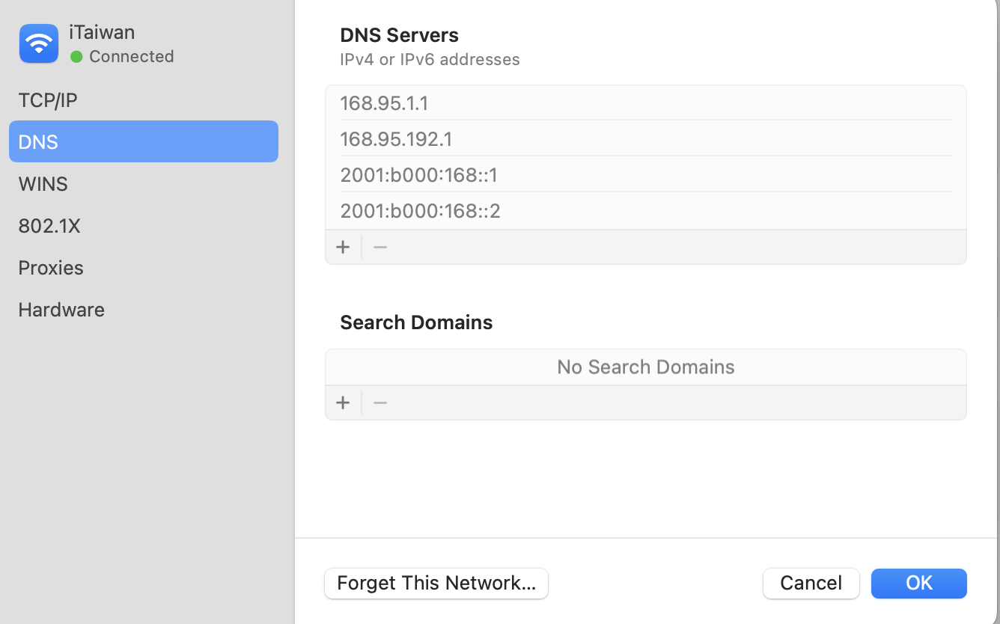

今天在桃園圖書館，因為手機訊號不是很好，所以想連 iTaiwan 網路。結果登入的畫面始終就是連不到，相當的納悶。雖然這個情況在 Mac 上面是常態，但我今天怎麼樣就是連不上。查了一下文章，找到簡單的解法如下，以下的方法皆為自己試過可行的。我認為這個可以算是個玄學，因為每個地方 router 設計皆不同，最好的辦法就是多試試。

# 解決不了首先重開機

首先最重要就是先將 cache 清掉，這邊建議直接重開機最快，有機率重開機就會自動跳出。如果重開機還是解決不了，那請繼續往下看。

# 可以試試看 Router 的 IP && 用可以跳出的裝置的 Domain

## Router 的 IP

打開設定後點選 wifi 的 detail，可以看到 Router 的 IP address ，有些公共網路的登入會直接設定在 Router ，不過最近比較少見到這種的。

## 使用其他裝置的 Domain

可以借用其他裝置，如果可以跳出登入畫面，那就用該 Domain ，paste 試看看。

# 清除 DNS server

以 iTaiwan 為例，若有自定義 DNS server，會導致無法連線。先將 DNS server 清除，並且將 Proxy 關閉，就可以解決。

像我原本就有自定義一個 1.1.1.1 ，先將自定義的按 - 清除掉，接著會跳出灰色字，此為 Router 設定的 DNS Sevrers。接著按 OK 馬上就跳出登入畫面了。

