這篇主要是參考李教授的影片，以及網路上的文章，整理的筆記。

# Algorithm 1: Training

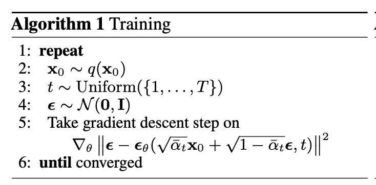

### **第 1 行：`repeat`**

- **作用：** 開始一個迭代訓練過程，直到模型收斂

---

### **第 2 行**

- **作用：** 從數據分佈 中取一個樣本 (x0)（即從訓練數據集中抽取一個數據點）。
    - **x0 代表 clean Image**。
    - **q(x0)：** 數據分佈，即訓練集中數據的真實分佈。

---

### **第 3 行**

- **作用：** 隨機選擇一個時間t。

---

### **第 4 行**

- **作用：** 取一個隨機噪聲樣本 。
    - **解釋：**
        - 擴散過程中，數據會逐步被加上噪聲，最終變成完全隨機的高斯噪聲。
        - 在訓練過程中，需要用隨機噪聲模擬這個擴散過程。

---

### **第 5 行：梯度下降更新**

```
∇_θ ‖ε − ε_θ(√ᾱ_t x_0 + √(1−ᾱ_t) ε, t)‖²
```

- **細節解釋：**
    - ε 為原始噪聲
    - **ε_θ(√ᾱ_t x_0 + √(1−ᾱ_t) ε, t) 這一段做的則是 noise predictor。**
    - 而 noise predictor 會有以下兩個 input

        **input 1. √ᾱ_t x_0 + √(1−ᾱ_t) ε ; input 2. t 代表第幾個回合的 回合越後面，加上的噪聲越多。**

        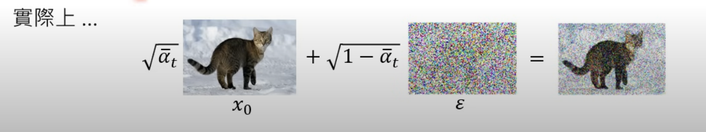

    - **√ᾱ_t x_0 + √(1−ᾱ_t) ε ：這邊 ᾱ_t 是根據 Unuiform 出來的 t ，如果 t 值越大，ᾱ_t 越小。 ᾱ_t 越小，代表加上的噪聲比例則越多（右邊乘上的√(1−ᾱ_t)）。**
    - **目標：** 最小化 ，即讓模型輸出的噪聲與實際加入的噪聲越接近越好。
    - **梯度下降：** 對模型的損失函數進行梯度下降，更新參數 。利用 MSE 平均平方差損失去算 梯度下降率。

---

### **第 6 行：`until converged`**

- **作用：** 持續迭代，直到模型訓練收斂。

---

# Algorithm 2: Sampling

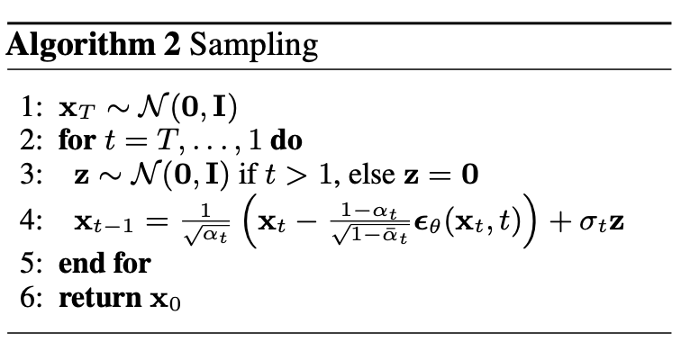

### **第一行 給訂一個 X 大 T 純雜訊圖**

- **意義**：從標準高斯分佈（均值為 0，方差為 1）中隨機生成一個噪聲樣本作為起始點。
- X 大 T 代表的是 **純雜訊圖**

---

### **第二行 迴圈開始**

從純噪聲一路 Sampling 到 生成圖

- **意義**：從時間t（最純的噪聲）開始，逐步回溯到 （逐漸去噪直到還原出清晰的數據）。

---

### **第三行 噪聲條件**

- **意義**：在 Sampling 階段，會在做完減去 Noise predictor 後，再加上 z 噪聲（請看第四行）
    - 但在 t == 0 時，已經完成 Sampling ，因此不再加上 z 。

---

### **第四行**


x_{t-1} = (1 / √(a_t)) * (x_t - (1 - a_t) / √(1 - ᾱ_t) * ϵθ(x_t, t)) + σ_t * z

**詳見：Sampling 階段 Denoise function 化簡**

- **分解理解**：
    1. ϵθ(x_t, t)：Noise predicotr 根據當前 t (哪一階段) 生成噪聲
    2. (x_t - (1 - a_t) / √(1 - ᾱ_t) * ϵθ(x_t, t)：從當前數據中減去預測的噪聲部分。
        1. x_t 代表的則是上一階段的結果，因此 = 右邊是x_{t-1} ，也就是逐步 Sample 到 x0 （clean image）。
    3. (1 / √(a_t))：（乘號左邊）調整信號幅度，使其回到正確的分佈範圍。
    4. + σ_t * z：添加隨機噪聲 ，**模擬反向過程的隨機性**。
- **目的**：從當前的t還原到上一個t 。

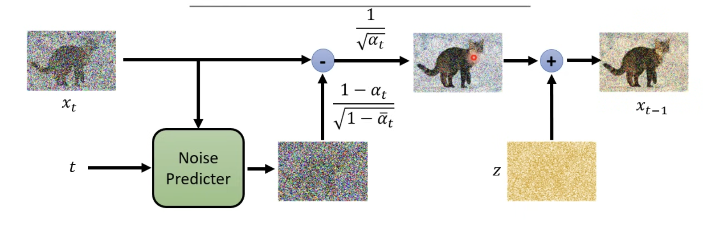

---

### **第五行 迴圈結束**

---

### **第六行 最終輸出**

- **意義**：當迴圈結束時，輸出最後的結果 ，這就是還原出的清晰數據（如圖像）。
    - x0 代表 clean image，因此 return x0。

---

# Maximum Likelihood Estimation

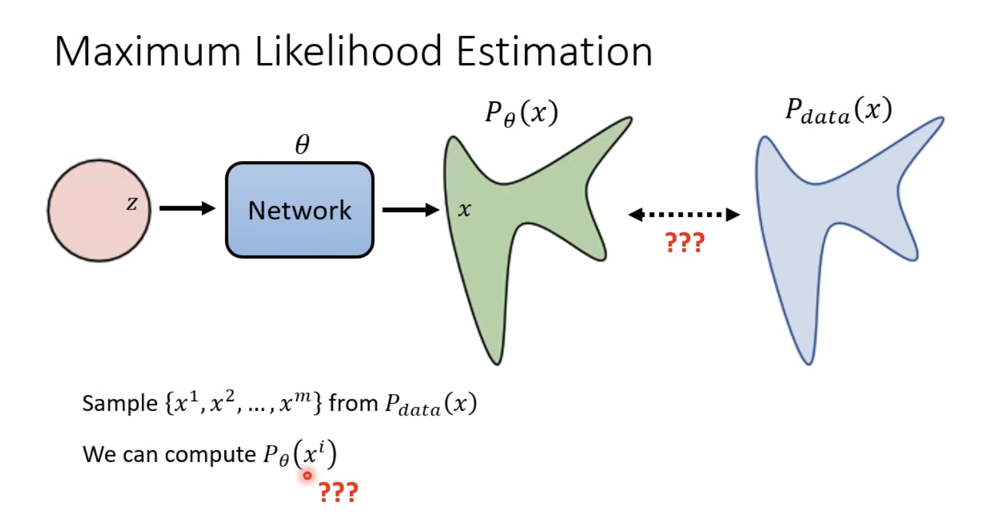

MLE 的目的是為了讓 Pθ 盡可能的接近於 Pdata。

- Pθ(x)：model 所 sample 出的 distribution 機率。
- Pdata(x) : 真實世界的 dataset，和 model 的 network 無關。


將每一個 sample 出來的 xi 拿 pθ 算出機率 並相乘，竟可能找出最大 θ。

所以我們要找的 θ 就是機率最高的那一個（LHY 在投影片用 θ* 代表）。

> network 的目標是學習數據的規律（真實分佈𝑞(𝑥0)q(x0)），然後模擬這些數據的機率，這就是𝑝𝜃(𝑥0)pθ(x0)。它代表模型認為數據𝑥0x0有多「合理」或「可能」。
*from chatgpt
>

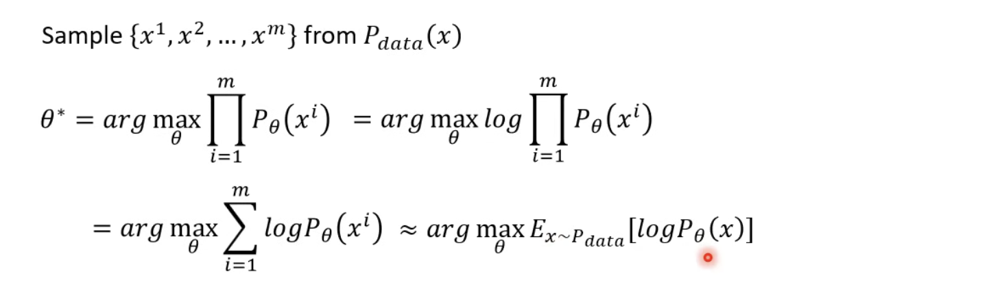

從log 相乘轉換成 相加log ，相加 log 這樣會近似於 從 pdata 取出的 x ，然後 pθ 算出機率 要越大越好。

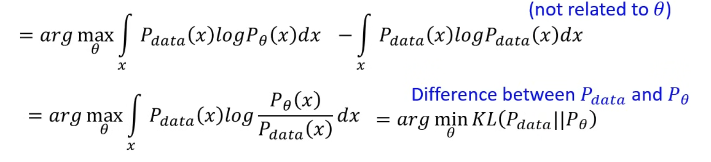

接著從 expectation 轉換為積分，然後可以算出就等同於 KL(Pdata||Pθ) ，所以我們要找 minimun KL。

讓 ptheta 讓 pdata的差異最小。

# VAE: Compute pθ

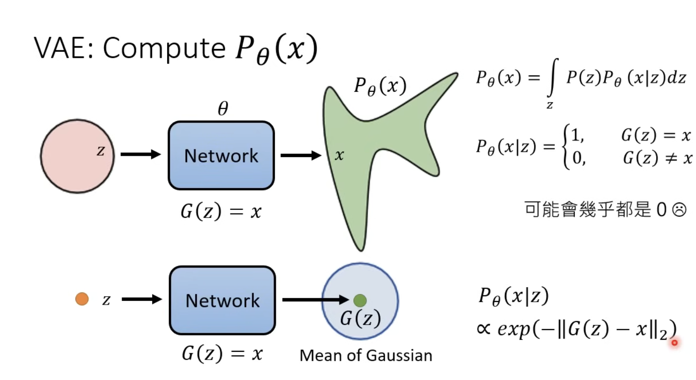

這邊主要是在講說，因為我們不可能去直接看 pθ(x|z) ，因為不可能 sample 出完全一模一樣的圖，這樣會造成 pθ(x|z) = 0。

因此我們是去看 Mean of Gaussian (去看距離，也就是 x 和 G(z)的距離)。

# VAE: Lower bound of

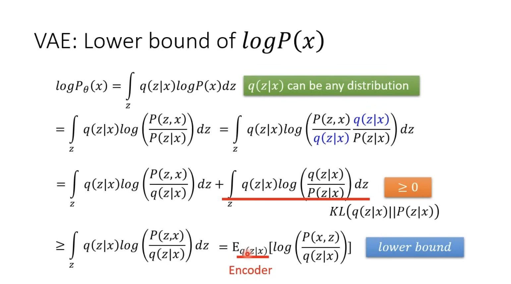

- ≥ 0 是因為 它可以看作 KL divergence 而完全一樣就為0，因此 ≥ 0。

# DDPM: Compute  pθ(x)

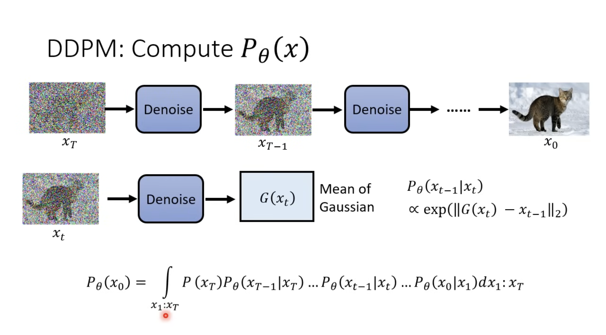

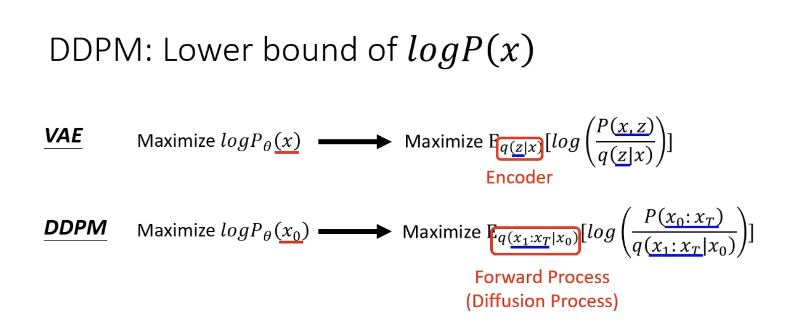

在算 DDPM 時，和 VAE 不同的是， Maximize 期望值時，原先的 Encoder 替換成 Diffusion Process，也就是在加 Noise 的那個階段。

將式子展開後為以下。

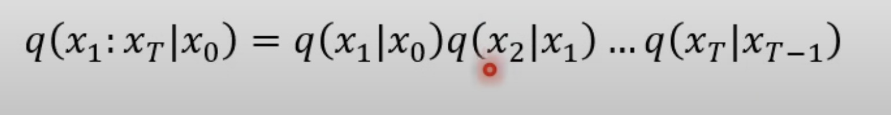

從 x1 一直做到 X 大 T

# 單個 q(XT | XT-1) 算法

我們首先要先定義一組 **β1 ~ βT** ，這組數值為自定義的，類似 Learning rate，會根據修改影響 Network。 因為這會影響在每一 t 加上的噪聲

（以下李教授有筆誤，應為 Xt = √1-Bt * Xt-1 + √Bt * noise）

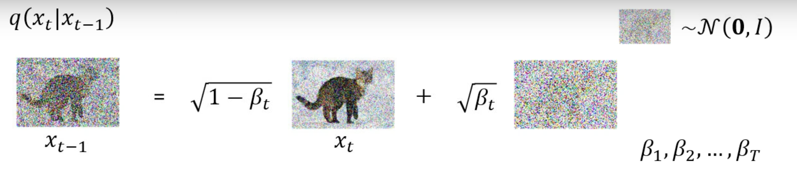

# 如果要算出 q(XT | X0)

其實是可以不用一次一次去把它算出來（不用一步一步把它+上噪聲）。

從下方可以推導出 q(X2 | X0)

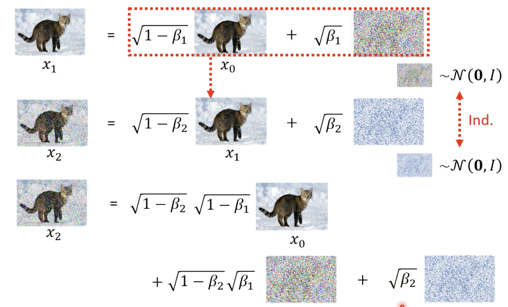

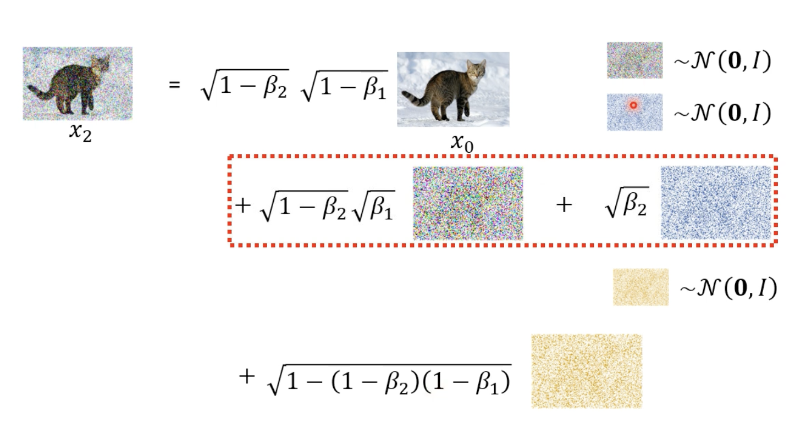

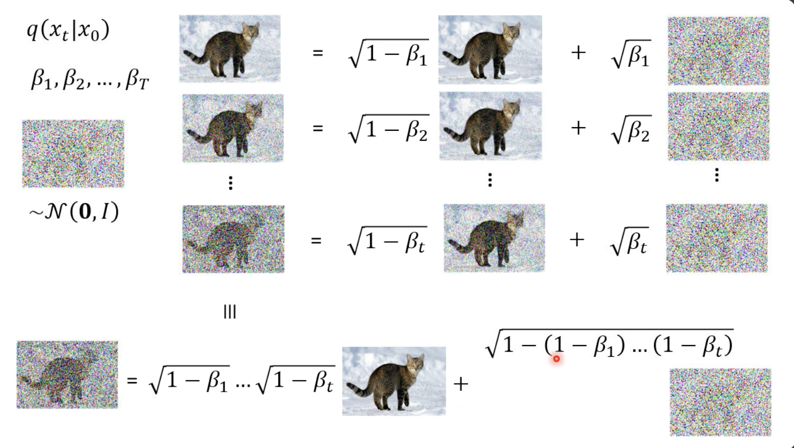

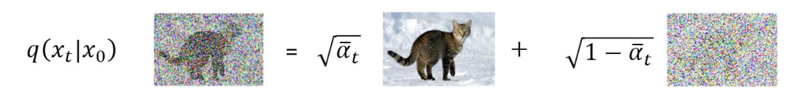

因此 q(Xt | X0) 就可以整理成上圖。

# 噪聲預測

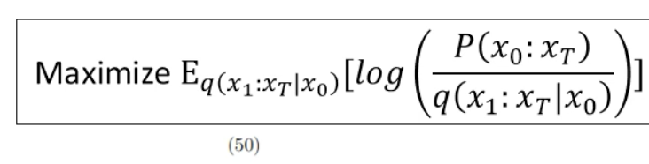

從上圖推導至下圖

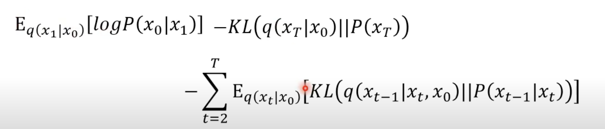

目標就是去最大化，而為了最大化，也就是盡可能地將 KL Divergence 最小化。（看後面的：KL Divergence between 向前 and 向後）

算出 KL Divergence 向前 𝑞 ( 𝑥 𝑡 ∣ 𝑥 𝑡 − 1 ) q(x t  ∣x t−1  ) 與向後 𝑃 𝜃 ( 𝑥 𝑡 ∣ 𝑥 𝑡 − 1 ) P θ  (x t  ∣x t−1  ) 的差異。

$\sum_{t=2}^T E_{q\left(x_t \mid x_0\right)}\left[D_{K L}\left(q\left(x_{t-1} \mid x_t, x_0\right)|| p_\theta\left(x_{t-1} \mid x_t\right)\right]\right.$

## 算出中間xt-1到xt的分佈 q(Xt-1 | Xt, X0)

前面我們已經講過了，如何算出從 X0 到 Xt，也知道要如何算出 xt-1 到 xt-1 的分佈。

推倒公式如下

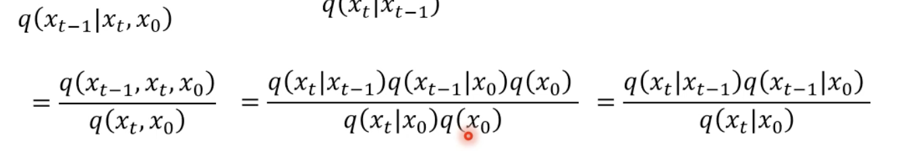

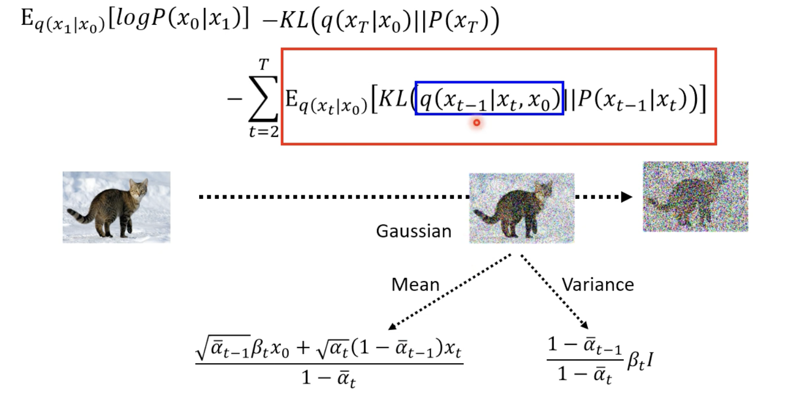

## KL Divergence between 向前 and 向後

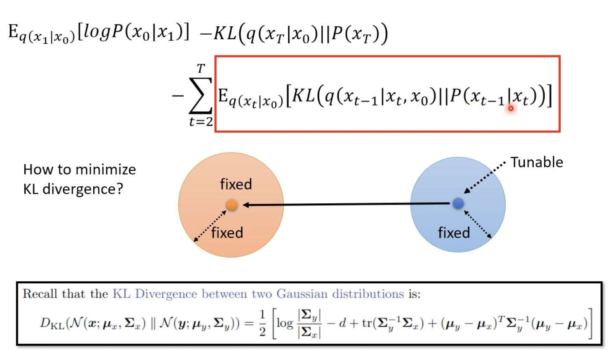

因為向前的 Mean 是不可動的，所以我們唯一可動的就是 P(Xt-1|Xt) 的 Mean ，使兩者離中心點的距離最小，這樣一來，就可以使得 KL Divergence 盡可能的小。

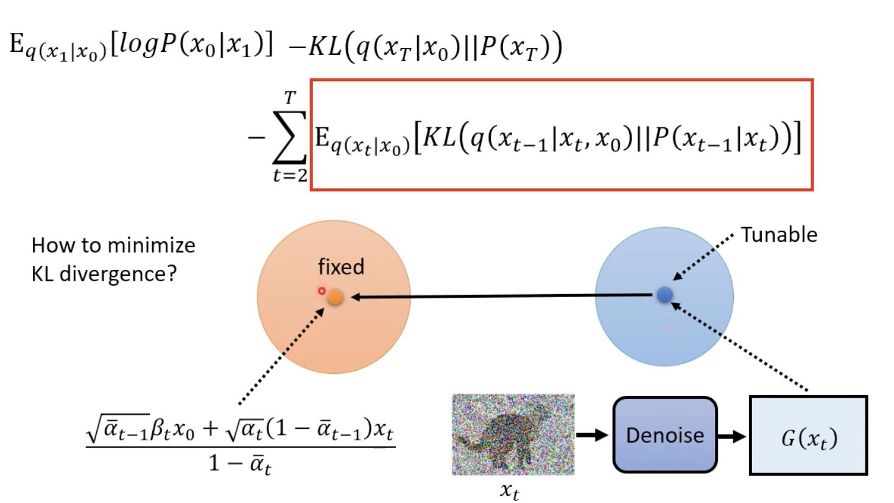

所以說以上在做的事情也就是訓練 denoise function ，使得它們兩者越相近越好。

# Sampling 階段 Denoise function 化簡

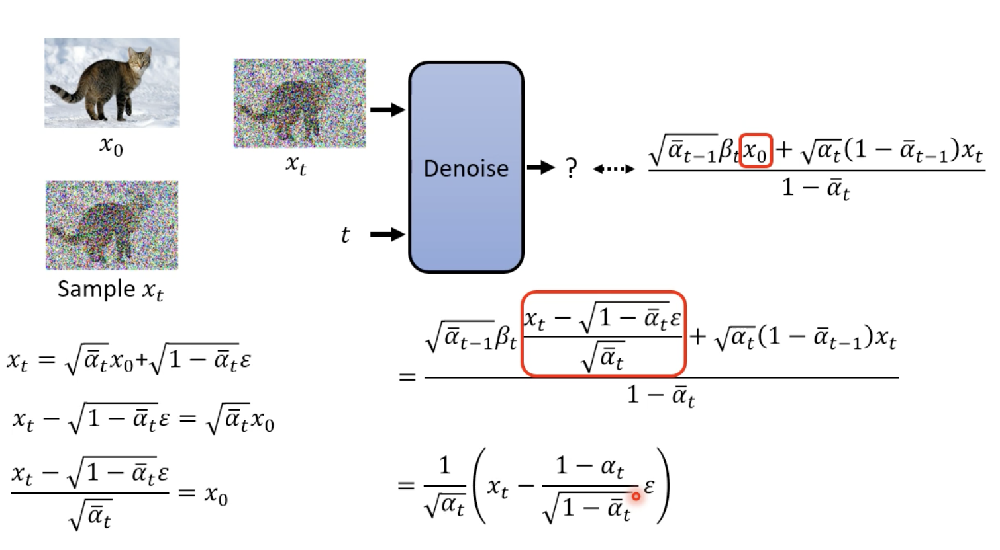

原先右上角的式子的 x0 可以根據我們上面已經寫好關於 x0 和 xt 的關係，在帶回去化簡。

而這邊也就回到 Algorithm Sampling 階段的第四行。

### Ref

[深入浅出扩散模型(Diffusion Model)系列：基石DDPM（人人都能看懂的数学原理篇）](https://www.cvmart.net/community/detail/7942)

[李弘毅 DDPM](https://youtube.com/playlist?list=PLJV_el3uVTsNi7PgekEUFsyVllAJXRsP-&si=_y39Uu28junvh9re)
