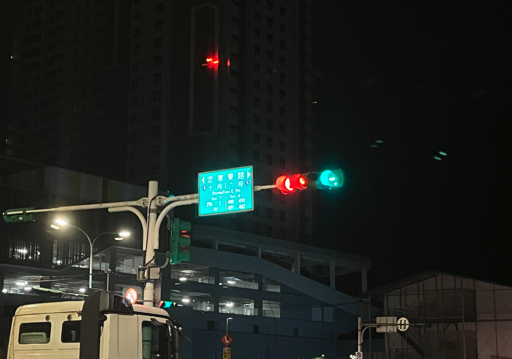
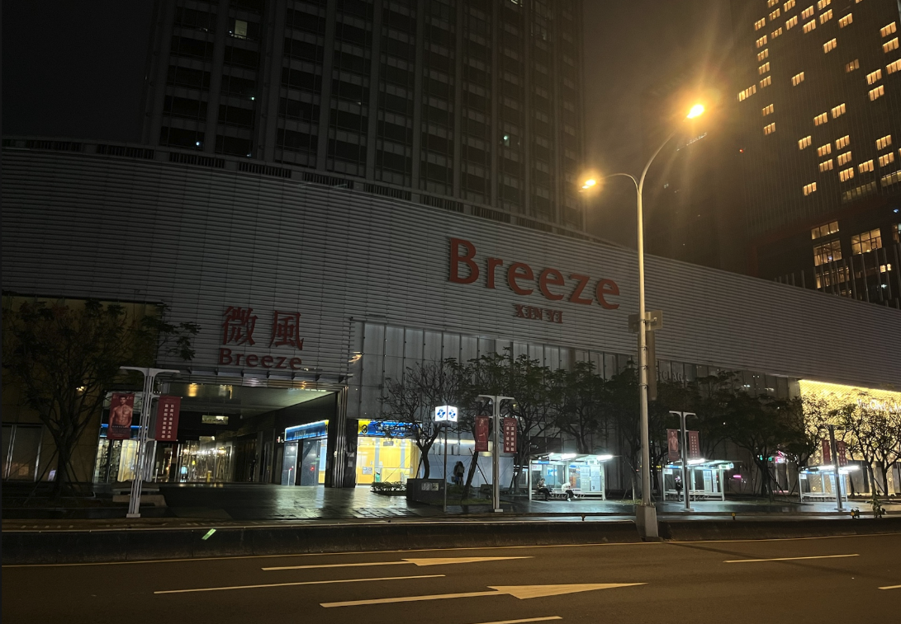
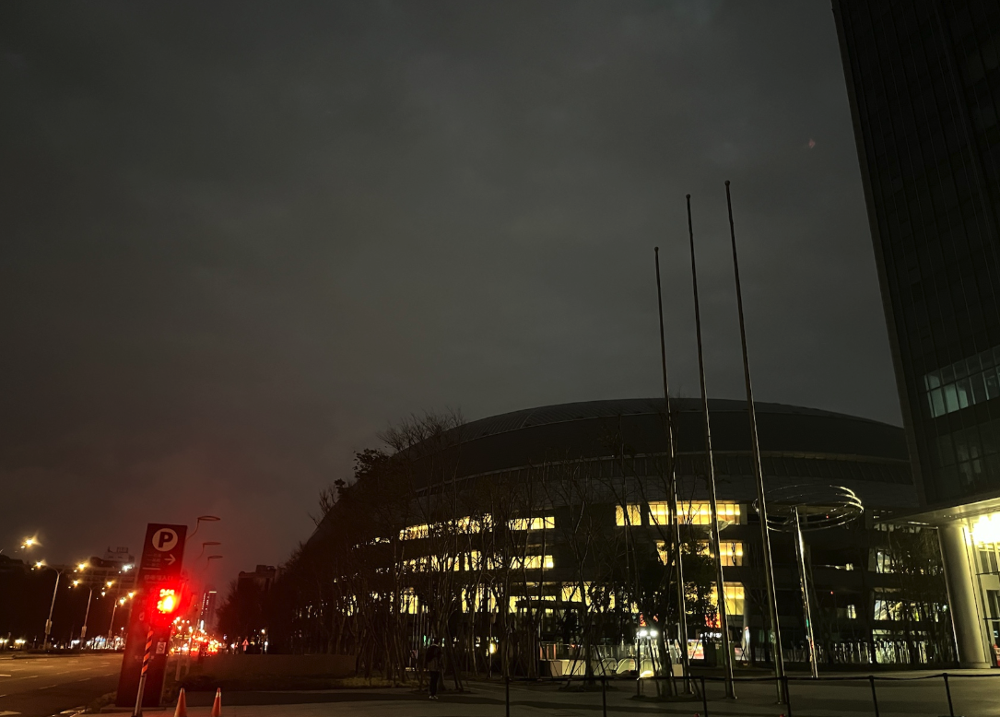

# 又又又又又消失了？

各位讀者好久不見，近期又消失了一波，算算應該有兩個月沒更新了。雖然這個站本來就是隨意更新的，但我是沒想到我會兩個月停更。

本來在寒假會更新很多的，但是寒假一躺就是一個月，生活過得很太爽。

## 寒假生活

寒假前兩個星期我的日常就是每天都睡到挺晚的，沒有 10 點別想把我叫醒的，然後起床後就開始打一打電動，然後晚上被朋友揪出去。

### 晚上被揪出去

老實說我沒有到很喜歡每天晚上都被揪出去，因為我隔天都會挺累的。具體一點是我沒有很喜歡坐別人的車晚上出去，因為這樣就要待到最後。如果我自己開車的話我就可以提前跑，但我也是很懶，懶到連開車都懶，騎摩托就更別說了，大部分時候都會覺得晚上路上比較危險一點。



### 沒人揪我的時候

通常沒人揪我，晚上又不想睡覺的時候，我就會開啟我的夜間超猛行程：**松山文創誠品**

誠品原先在信義誠品有 24小時的書店，但自從信義誠品收掉之後，書店就轉戰至松山文創的誠品。信義誠品的夜間我自己是沒去過（感覺挺棒的，建築那個分類那邊還有超大落地窗可以看風景），但是松山文創誠品我倒是只有夜間去過，我經常吃個宵夜就去那邊看旅遊書，12點左右那邊還有固定 NPC 會拿一疊書然後看一看睡著，大家經常去的話可以去找看看xdddd。





# HomeLab 升級

這應該算是我寒假最忙的一件事，去年底我買了一台新電腦準備升級我的 NAS 。雖然原先用的 j1900 其實完全夠我使用，但我開始會在上面測試更多的服務，越來越不夠我使用了，因此就開始物色新主機。原先考慮 E3 神教搭配華碩 p10s ws ，這個搭配其實我自己滿喜歡的，光是主板配兩個 intel 的千兆口，我整個就受不了，慾火難耐啊！後來朋友告訴我買4c8t 不如考慮一下 zen2 的 2700x，8c16t 一顆不用 2000 要什麼自行車？後來被我看到 2400g 的整機，本來都準備面交了，不小心被我看到他裡面有賣 2700x，我就問他能不能上 2700x 給我，給我賺到一波了屬於是。雖然我後來發現 dram 有一點問題（不知道為何開 windows 不會出問題，一開 linux 就有機率死機），但目前使用都還行，以後有問題再說吧！ 以後有機會再分享一篇這次升級的過程。

# 忠孝東路走不了 9 遍 走 1 遍就好

就是聽到這首歌詞，覺得很荒謬，然後突然在想走一遍真的會很難嗎？剛好我住南港，走到台北車站剛好一遍，想著來試看看吧。

如果要說很難，我覺得不至於，我大概走兩個多小時就到了，但台灣的騎樓是真的難走。

# 除了玩樂以外

其實最近完成了不少事情，比如說我一直想做看看開源，但一直以來我都不知道要從哪裡開始，發現學校教的任何事情竟然都派不上場。但最近 contribute 一個 40k stars 的 RAG 的項目被 Merge 了，當下我真的很開心，終於是開始進入到開源領域了。

學校最近在寫 interpreter，雖然我的進度不是全班最快，但至少進度也沒有太慢，而且寫起來覺得蠻有趣的。

 

 

好了，以上就是總結我這兩個月的生活，期待繼續努力！
