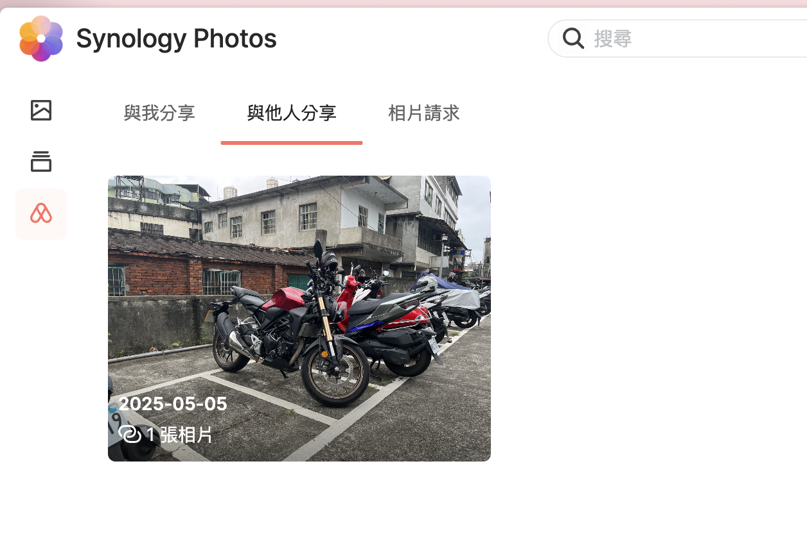

Jabee我的人生座右銘就是 **資料要備份，Format要謹慎。**

一直以來，我都把資料的儲存看作是使用電腦設備最重要也最需要注意的事情，畢竟資料就像紙本資料一樣，需要整理、存放。不同在於使用電腦儲存資料易存也易消失。

一場大火燒掉整間屋子的事，有，但機率相當低；手機被我們摔壞的機率卻相當高。

所以如何儲存資料，我認為是21世紀每個人都要面臨且學會的事情，否則下一個哀嚎說手機突然壞掉，裡面照片全部不見的人可能就是你了！

# 什麼是 NAS ?

NAS 全名為 Network-Attached Storage，從全名可以看出使利用網路來儲存資料。但 NAS 不同於 Google Drive 等線上雲端硬碟服務，NAS 會是一台真實的設備，放在你家，當開機的時候才可以使用。

白話文講就是 NAS 就像你自己架的 Google Drive，不過功能更多、更強大，而且不用月費！也就是你能存多少就完全取決你買多大的硬碟裝在 NAS 上了

不用月費就可以儲存上 TB 甚至 PB 的資料，你心動了嗎？ 先別急，我們先來說說缺點吧！

# NAS 與雲端硬碟的優缺點對比

## 需要有放的地方

前面有提到 NAS 就是一台裝置（電腦），所以你需要有一個地方來放這台裝置，根據你買的型號，需要的大小也不同。最小的 2-Bay （兩顆硬碟位）機型大概也可能比兩台 Mac studio 大台，畢竟兩顆 3.5 寸硬碟也不小，還要加上主機板的大小。另外，通常 NAS 都不會有無線網卡（雖然群暉有提供驅動，但我相當不推薦用 Wifi），意味著你擺放的位置需要原本就有辦法接 RJ45。

## 電費問題

通常我們為了隨時隨地可以取資料，NAS 開機就不會再關機了（除了在試東西的時候）。如果你購買的是品牌機 NAS 像是群暉等等的，而且硬碟數在兩顆，那估計不用考慮電費。這種 CPU 功耗想當低，就算常常在使用 NAS 一個月的電費應該也不會超過 100。但如果不是，你可能就要算一下電費。

## 傳統硬碟不貴，但需要一段時間就要買新的

回想10年前我們在玩 GTA5，一個遊戲要 100G 的空間，當年有 128G 的 SSD 就相當有實力了，但如今隨便一個線上射擊遊戲就是 50G 起跳甚至100G。

你說那是遊戲，遊戲又不需要儲存，那我再舉一個例子：十年前的頂級全畫幅相機 Sony A7 一張照片大概在 30MB 左右，如今哈蘇中畫幅一張照片都上百 MB 的。

現在要買 1TB 的傳統硬碟都快要買不到了，隨著時間，我們儲存的資料也越來越大，所以你現在買10TB 看似很夠用，但三年後呢？

另外，通常使用 NAS 會至少組 RAID1，也就是你要買兩顆 10TB 的硬碟才能存 10TB，算上每 3-4年升級一次，費用絕非雲端硬碟的月費價格可以負擔的！

<aside>
💡

什麼是 RAID1？

雖然傳統硬碟並不像 SSD 有讀取寫入次數，但還是有機率會壞軌，像是因為針頭刮傷盤面等等的可能性，一但刮傷的部分就無法讀取，所以會有一些方式來保證資料安全。

RAID1 會同時將資料送進兩顆硬碟中，所以當硬碟一顆壞掉時，另一顆硬碟還可以救援。所以也有一些玄學表示組RAID1 要用兩個不同批型號的硬碟，避免同時兩顆壞掉。

</aside>

## 噪音問題

通常會將 NAS 放在客廳中就是因為傳統硬碟在隨機讀取的聲音其實很大，尤其是夜深人靜的時候。所以你大概率無法把 NAS 放在需要寧靜的地方。

基本上以上的問題你都 ok，那接著下一步就可以來挑硬體了。

# NAS 主機

NAS 大致就分兩種：

1. 品牌機
2. 自組

你對網路以及 Linux 不太熟悉的話，相當建議就選品牌機。若有點概念，想省點錢，再來考慮自組。

## 品牌機

目前市面上品牌機我認為也不多，你能常看到的就以下幾個：

- 群暉
- QNAP
- 華芸
- 綠聯

### 群暉就是首選

我會建議，首選群暉。雖然除了群暉以外我都沒用過，但通常聽到我有朋友買非群暉的 NAS，都是直搖頭。

群暉到底有沒有料，我認為我自己從高中用到現在，算是相當穩定，一次開機大概就是半年以上。在功能上，也是相當齊全，但這完全是建立在我用的到的情況，文章最後我會分享我用到的功能。

## 自組

自組 NAS 在 2025 的可用性其實已經相當高了。目前開源的項目比較大的就是 TrueNAS，而閉源但免費的項目也有 FnOS。其實現在回想起來當初堅決不用 TrueNAS 的原因比較大是因為沒有完整好用的照片系統（最重要的是要支援 iOS）。不過目前這個也有解，可以採用 Immich 來進行相片管理，也有 iOS 的 APP。而 FnOS 也有自己的相片管理，也支援 iOS，不過短時間我也不會轉，因為目前用的挺穩定。此外，也有所謂的 X群暉，但這個遊走在法律灰色地帶，所以 Jabee 我不鼓勵也不支持。

# 群暉的體驗心得

## 相片管理

我從 DSM 6 開始使用，當時群暉主打 Moments 相片管理系統，其實已經相當好用，一段時間後升級 DSM 7，並且同時升級成 Synology Photos。目前 DSM 7 最新版本已經不支援 H.265，用蘋果設備的讀者可能就會有點小頭痛。

2025年的今天，各家手機廠商的相片系統都在捲 AI，而群暉還在用他們用 OpenCV 研發的超級爛辨識，我只能說那個 AI 功能還不如不開（所以我現在沒有在用該功能），除此之外也沒什麼好抱怨的。

另外網頁版的功能會稍微多一點，可以篩選鏡頭、相機型號、光圈等等，還算方便。但這個功能並沒有辦法在手機上操作。

另外照片也可以直接分享給其他 User，這個很方便（但我這台主機也只有我跟我老爸）。

## Synology Drive

Synology Drive 可以透過 client 的 App 幫助隨時同步本地資料。

異地備份對我來說應該是最重要的一件事，以前總是擔心重要的資料會因為硬碟撞到、甚至是主板掛掉導致資料消失，使用異地備份就可以避免這種事情發生。

不要不信邪，我在 22 年初一天早上起來，正準備打開我的 M1 MacBook Air，才一開蓋顯示兩秒就整台死機，再也打不開。因為現在 SSD 顆粒都直接焊死在主板上，蘋果 Genius Bar 沒有能力幫我把顆粒取下重新裝到保固換新的主板上，所以整台資料全部不見。但我卻幾乎沒有損失資料，因為所有資料都透過 Synology Drive 保存。

## 額外的服務

其實群暉的功能很多，絕對說不完，包含 VM、VPN Server、USB Copy、Download Station ，這些都是我常用的服務。

另外如果有點動手能力，container manager 可以裝上各大在 Docker Hub 的項目，增添群暉沒有提供的功能，例如 Home Assistant 等等。

# 總結

用了這麼多年的 NAS，我想一種比喻可以說明我對 NAS 的想法：NAS 就如蘋果的裝置，用了就回不去。一方面當然是數 TB 的資料要移轉不太可能了，另一方面是 NAS 真的從根本解決了我很多問題，對我的數據保障有了一個檔次的提升。

我會說如果買 NAS 是用來儲存資料，那就太浪費了，但如果你常常因為沒有輕量的 VPS 可以使用，那買一台 NAS 真的是你的不二選擇。
