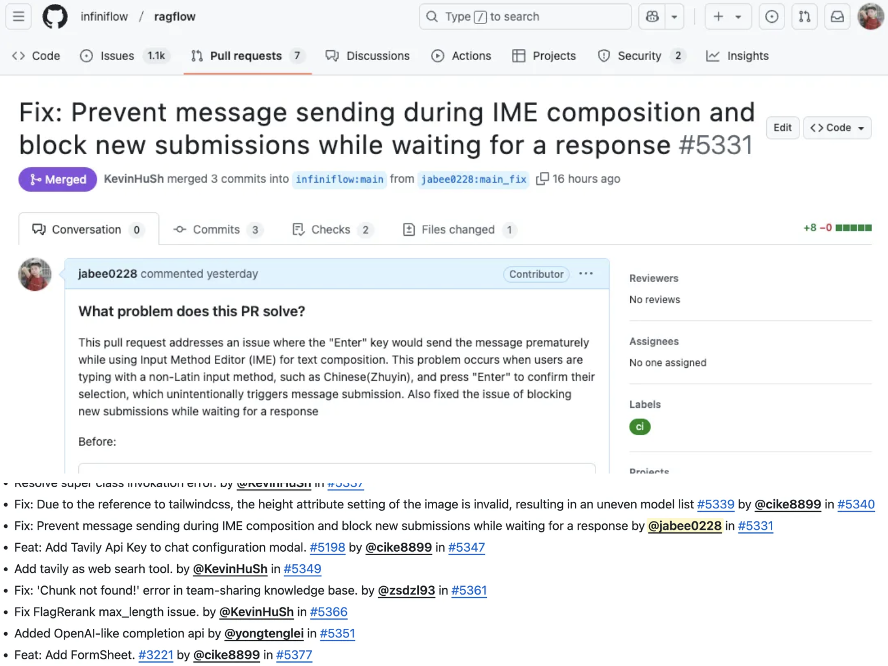
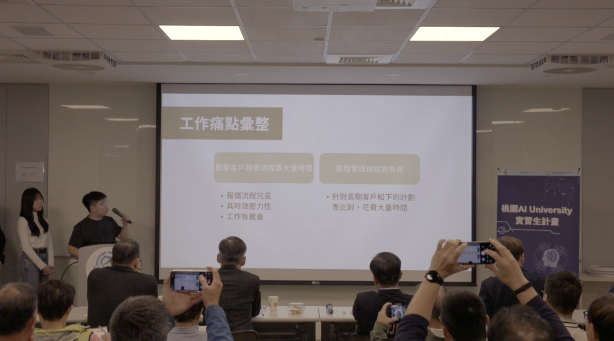

今年寫 Recap 時，翻了一下去年的 [2024 Recap](https://jabee.live/notes/241223/)，覺得今年很可以在標題加入一個代表今年的句子。

今年我以 "AI Agent 再次改變了一整年" 作為標題，我認為一點都不過分。在今年開始大量所謂的 "Vibe Coding" 可以算是進入到一般非電資人的視野裡，大家開始提倡使用自然語言描述的方式來寫程式。而對我的改變也是極大的，雖然這是可預見的未來（也許早該是你我在 2023 就應該知道的事），但 Vibe Coding 的能力仍然在今年震撼了我，也改變我工作學習的方式。

# 課內的學習

要說有什麼特別的，我覺得沒有xddd，但身為一個大學生（至少大三下結束以前還需要上課），說自己在學校沒有學到東西，屬於是有點過分了啊！

2025 上半年對於一個中原資工大三的學生不外乎就是處理一件從大一開始被各種學長姐說的中原資工 Ending 大魔王 AKA 當掉一半的人 AKA 近幾年沒有人寫完作業：PL 程式語言( Programming Language ) ，看似課程名稱寫程式語言，但其實就是直譯器開發。整學期的目標就是完成 Scheme Interpreter。我認為比較可惜的是今年不是寫 C language 的直譯器，一方面 C language 是大家都會的語言，寫 Scheme 直譯器不僅要先學會 Scheme 還得依邊把直譯器刻出來。

要說簡單吧，我也不敢嘴砲說有多簡單，要說難，我們其實這屆修課的人覺得也還好。有人很拼，一個月就寫完，我則是寫到期中考時寫完。這個作業對於大家 Debug 的能力有極高的挑戰，在 2025 上半年各種 LLM 和 AI Agent 的能力無法完成這個作業，所以百分之99的人應該都是獨立完成。

有興趣的話可以點 [Repo](https://github.com/jabee0228/CYCU-ICE-PL-INTERPRETER) 的連結了解這個作業。

# 課外的學習

今年課外的學習能夠說非常多，多到自己寫稿的當下也覺得不可以思議？

## 完成第一個被合併的 PR 在開源社群上

今年第一個完成的事情不用說就是我在 [RAGFlow](https://ragflow.io/) （目前 stars 大概 71.4k）的 PR 成功被合併進入。今年年初的時候在玩 RAG，偶然看到這個開源項目非常興奮，就把容器拉下來到我的伺服器玩玩。用的感想是馬上發現前端介面有 Bug，然後就看了看源代碼：哎呦我好想可以解掉誒，花了一小時看了一下代碼就知道問題出在哪，著手把代碼修復，然後反覆測試就發了 PR。沒想到第一個 PR 的敘述似乎沒有寫清楚，幾個 Comment 之後就被 Close 掉，後來重發了一次，換了敘述就成功被合併（甚至多解決了一個問題）。

## 中央研究院資訊科學研究所暑期實習

真的很幸運的有機會到中央研究院資訊科學研究所暑期實習。老實說那邊的強度真的不是開玩笑的，每個人都超強，每個人報告的能力都有很多值得我學習的地方。這兩個月說真的有點短，老師給我們報一些他有興趣學的東西，然後也讓我參與計劃案，大概是我今年最值得的經驗！

## 發了一篇 Conference Paper && 專題得獎

年中終於把大學三年最重要的事搞定了，在年中論文也順利被 Accept。我想今年最遺憾的大概是國科會竟然沒有上，這真的是很意外，完全沒有想到的事，畢竟過去幾年中原資工每年都是過10來件，余教授則是每年都過2件（上限2件），今年一件都沒有。雖然教授不斷說著做研究沒有一直順利的，但畢竟會影響到推甄，仍然覺得很傻眼。

但至少最後結果還不錯，拿了系上的第一名，微星院盃佳作！

## 參與桃園 AI University 實習生計畫

暑假期間，余教授問我們要不要參加一個類似營隊的東西，但我們都心裡很清楚接下來推甄應該會忙得要命。最後我看到有機會參訪工廠，我就選擇報名參加了。AI University 由中原育成中心的一家公司主辦，主要就是邀請傳產企業和同學一起來上課增加企業的 AI 實力，每一組都會有一個企業和數名同學參與，企業也會派管理層甚至老闆來和同學一起上課。

我自己滿感謝有參與這個課程，雖然老實說學到的東西確實不多，但我們在課程中也清楚看到目前傳產面臨的問題，包含了：尚未數位化、AI的加入是否有辦法和現有產線作業員配合等等諸如此類的問題。像我在這次課程中**也清楚看到傳產的問題有可能不是 AI 不 AI 的問題**，而是沒有導入資訊系統導致的產線處理花費工時、對於產線目前作業的進度不夠透明等等問題。

在這次 AI University 我們組和宣瑞股份有限公司進行配合，我們就清楚了解到宣瑞的問題如圖面展 BOM 、料號工序價格等等管理沒有一個好的管理方式，全部存在 Word 、 Excel 中，甚至分散在不同的檔案中。我與組員共同開發針對宣瑞的資訊系統並導入自動化與 AI，讓宣瑞在接到訂單時又更快的反應時間可以將報價發給客戶。不僅僅是節省客戶等待報價的時間，管理層也能有更多時間去針對產線管理。這套系統也獲得宣瑞副廠長的讚賞，因為確確實實的解決他長久以來報價困難的問題，完全解決了宣瑞在交接給二代後產生的企業痛點！

# 意外獲得一個工作-資訊處專案開發助理

程式語言課程的學習系統完全開源，教授和助教也鼓勵我們進行貢獻。我在一開始做作業的時候有發現幾個小問題，就順手幫忙修正。到了期中左右，負責系統的助教就私下詢問我有沒有興趣接替他至資訊處做專案開發助理。想著就嘗試看看吧，難得有天底下掉下來的工作，也許推甄還可以寫進去的經驗，待遇也比學校工讀高得多（算月薪的，真的還不少）。這個位子應該是好幾年前就有的，似乎是持續找資工系的同學進去做，就是負責開發學校全新的校務系統。

這邊開始吻合今年的 Recap 標題了！"AI Agent 再次改變了一整年" ，年中開始，整個工作開始翻天覆地的大改變，開始大量使用 Agent 來進行開發，當然開發的速度提升，主管要求的速度也提升xddd。

我認為 Agent 的出現完全取代前後端 Junior Programmer，因為只要有 Sample code，剩餘的程式只要照著 Sample code，AI 基本上都有辦法做得到（當然複雜的邏輯如 jwt 等等的處理有時就需要人工介入開發）

這些 Vibe Coding 的經歷大概是我在入職前完全不敢想的，現在一天的產量有辦法是 3000 行程式碼。當然我認為 Vibe Coding 目前仍然遇到程式碼不夠乾淨、偶爾邏輯會卡死的問題，但不敢想像我們曾經一個月也有4萬的前後端工程師快要完全失業了？

# 推甄-從中字輩推到中字輩

每次都開玩笑我們是 TVBS 認證中字輩xd

大概從今年開始，我就時常開玩笑說有點想去中正讀書，畢竟沒試過住在鄉下，應該會很有趣。另一方面我單方面以為中正很偏遠沒人要讀（才沒有），所以我就常常說我要讀中正。開始做備審的那段日子真的壓力很大，我甚至去報了我完全沒想去的台師大 AI 。倒是備審資料做的得心應手，畢竟有特殊選才的經驗，這次很清楚的知道要寫什麼，幾乎沒有猶豫，只有在校稿時花了不少時間除錯。回頭看我的履歷也發現大學這三年雖然比賽不多，但經驗也不少了，重點幾乎快塞不下一頁了哈哈！在研究計畫其實也寫得很心虛，畢竟我很確定自己不會繼續做 CV，但為了呼應我大學專題的研究幾乎每一間都寫了未來要做 CV，在中正面試時甚至在回答教授問我有沒有什麼相關研究了也很自信的回答最近 Survey 的論文（看教授的臉就知道他很滿意哈哈哈）。

雖然中興台師都有錄取（甚至台師還逕取），但最後還是選了中正，也算是上了自己原先計劃去的學校。希望未來不會後悔這個決定～ 繼續在 Processing-In-Memory 上做出更好的研究！

# 信仰

今年學校開了一間新的教會：Life3中原•生命樹浸信會（這應該是校園內開的第三間了，甚至沒有算上校園旁的）

上帝很奇妙，在我某個星期日去學校讀書的時候，例行在外面曬太陽吃著麥當勞就看見這個剛建堂第二週的教會，後來就穩定參加青年的小組。中原生命樹第一次讓我知道什麼是教會有家的感覺，很感謝在我推甄壓力很大時有傳道澤宇和以愛陪伴我，為我禱告。雖然好不容易在中原找到教會就馬上離開了，但我相信中原生命樹會在中原讓更多的同學知道福音的美好！

# 心態

今年我覺得心態也有些轉變，變得很向錢看，一步步的動作都想著未來這樣好不好找工作、這個方向的薪水高不高、做 CV 會不會餓死，這樣的問題每天都在反覆思考，但真的兩年後的市場是怎麼樣又很未知了。今年記憶體漲翻天，但兩年後呢？這是炒作還是真的有需求呢？ 

每天在思考這些無意義的問題，卻沒有真的去找自己想做的事，讓我變得開始盲目。但感謝上帝，最後選了一個和我興趣相符的學校與教授，現在只希望未來研究所可以快樂做研究兩年。

 

 

今天讀聖經時讀到一節有趣的經文：世人行動實係幻影。他們忙亂，真是枉然；積蓄財寶，不知將來有誰收取。主啊，如今我等什麼呢？我的指望在乎你！（詩篇39篇 6-7 節）

我們總是想著要怎樣賺錢，怎樣發大財，卻沒有仰望上帝給我們要走的路。希望 2026 年，能更了解上帝要我走的路，更活在主的愛中～ 也希望在中正能找到一間適合我的教會！
