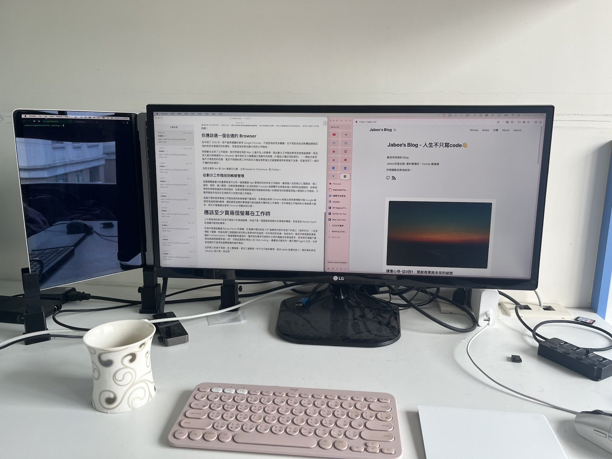

這是 Jabee 我的「[BlogBlog 同樂會 - 2026 年 4 月](https://blogblog.club/party/?ref=wen-lab.tw)」的投稿文章。本月主題是「[生產力](https://www.wen-lab.tw/blogblog-party-productivity)」！

Jabee 在上大學前每天高中的日常就是早上到學校先抄一抄功課（因為前一天是不會寫的），然後該考試就考試，上課時間就看 Yoututbe，看完 YT 就看 B站，看完 B站就滑 IG （以下無限輪回），接著回到家就睡覺、吃晚餐，過上美好的一天。

美好的一天其實就是頹廢的一天，雖然我覺得重來一次高中我大概上課還是只會滑手機，但我覺得我浪費了不少我高中的放學後時間，沒能在那段時間多學一點技能對我來說是可惜的，可以說是整整浪費了時間，對於當時的我來說沒有任何 "生產力" 可言。

# 上大學後的轉變

## 在家建立兩個工作區域 && 至少買兩台電腦

上大學後，我搬去中壢老家，幸運的是家裡非常無敵大，光是我的房間就10坪了。我開始劃分我的工作區域和玩樂區域，利用兩個完全獨立且放在不同地方的桌子清楚劃分我的工作和玩樂。

我開始發現這樣的方式大大提升我的效率，過去我打開網路學習一下，我的 IDE 可能會突然變成 CS:GO ，接著玩一玩發現該睡覺了，一天又過了。但如今簡單的利用劃分兩個工作區域，可以避免我的專注度被其他東西吸引走。

但工作和玩樂的地方分開了，前提勢必需要兩台電腦，而我也強烈建議你要至少買兩台電腦。你可以使用不同的作業系統或是不同的桌面來增加你的工作感，因為當你熟悉某一個介面的時候，你就會知道這個地方使用上來不是給你打電動玩樂的地方。以我目前的例子來說，我在工作階段只會使用 Mac OS、Kubuntu；反之，在遊戲階段，我會使用 Windows、Bazzite。我父親常說該讀書該讀書，該玩樂該玩樂，我也相當認同他的說法，沒有人都不休息的啦！

## 你應該選一個合適的 Browser

如今到了 2026 年，我不會再建議你使用 Google Chrome，不是因為他有多臃腫，也不是因為自由軟體追隨者認為的他有多會侵犯你的隱私，而是因為他無法劃分你的工作階段。

即使劃分出來了工作區域，我仍然會在我的 Mac 上進行私人的事情，**因此劃分工作階段對我來說相當重要**。我目前大部分時間使用 Arc Browser 當作我的主力瀏覽器已有數年的時間（大概從大爆紅用到現在）。一開始也是有點不太熟悉他的改變，甚至不對稱的將工作列放在左邊這是對直立式副螢幕使用者相當不友善，但當我用了一個月才懂的他的美好。

像這樣的 Browser 目前主要有 Arc 和 Zen 兩個可以選，分別 based on Chromium  和 Firefox。

### 從劃分工作階段到帳號管理

這類瀏覽器最大的重要就是可以用一個瀏覽器 App 管理好你的所有工作階段。像我個人目前就分三個階段：個人使用、學校、個人開發。如果我要瀏覽個人生活的例如 Youtube 或網購平台就會在個人使用的這個階段，如果是學校的學習就會放在學校階段，如果是管理我家裡的伺服器或我個人的開發項目就會留到個人開發的工作階段。只要用兩指手指往左右滑就可以快速切換工作階段。

這最方便的是我每個工作階段使用的帳號都不盡相同，如果過去使用 Chrome 就會出現我要頻繁切換 Google 帳號等等超煩瑣的事情，應該避免這樣的事情儘可能地避免打擾你的工作進程。另外每個工作階段的分頁都會分類好，再也不會像過去使用 Chrome 很難找到分頁。

# 應該至少買兩個螢幕在工作時

上大學後我的桌子從來不會放少於兩個螢幕，但這不是一個耍帥或是顯示你專業的機會，而是源自 Randy Paush 在演講中提到的事情。

在高中我曾經看過 Randy Paush 的演講，在演講中提到他從 CRT 螢幕時代對於他底下的員工（或研究生）一定是標配 3 螢幕，他認為買三個螢幕的成本對比能帶來的效益是一件非常好的投資。他認為你一直在切換視窗就像電腦的 Context switch 一樣會需要耗資源的。雖然現在看來可能對比古老的電腦沒有差這麼多，因為現在電腦不會因為換個視窗要等個1-2秒，但我認爲對於現在人在 Vibe Coding 一邊看程式碼另外一邊又要和 Agent 交流，也許是這個世代直得投資雙螢幕的最好理由。

也許對普通人的桌子來說，放上雙螢幕，甚至三螢幕是一件不太可能的事情，因此 Jabee 這邊也給上一個完美的桌搭 Solution 給大家。如圖，我目前回到台北 Gap 半年，因此將 Macbook Air 橫向放置並且搭配 21:9 的螢幕，組成的假裝三螢幕，個人回台北後使用了兩個月了，非常滿意。

# 番外篇：組一台 NAS 吧！

Jabee 在文末也和大家推薦還是建議每個人都組一個 NAS 或是買一個成品 NAS。這絕對不是幫群暉、威聯通、綠聯 打廣告，而是我認為我不會隨時都帶著電腦。當你盡可能地把所有檔案放入 NAS 後，利用手機遠端查看檔案，減少你會有所謂的：「啊我忘了帶電腦，等等回家看看」的諸如此類問題。再來，拿隨便一台不要的二手電腦來組 NAS 再買個硬碟和你買一個隨身 SSD 硬碟不會差多少錢啦，畢竟現在 SSD 也是貴得要命。

