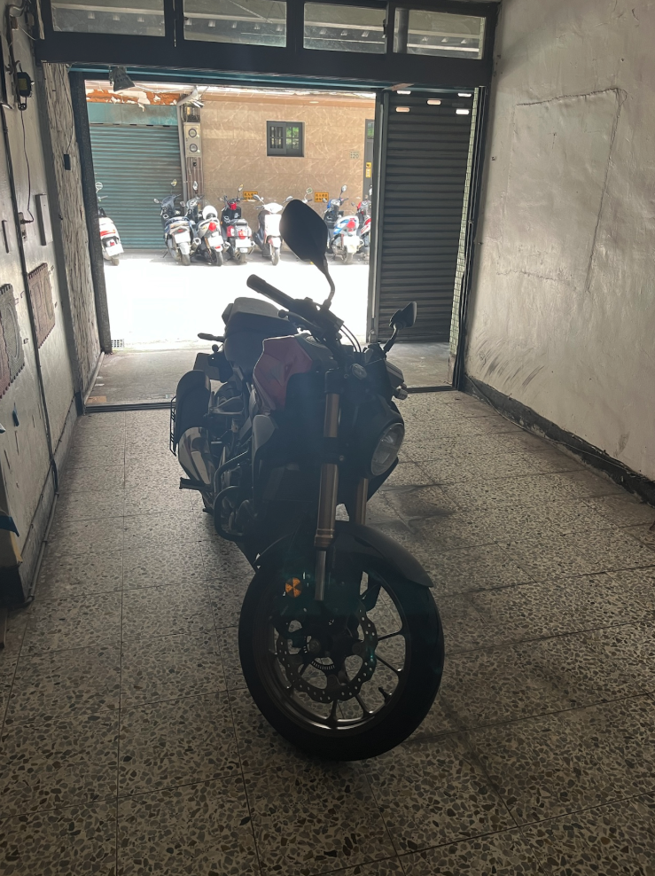

昨天一早回去中壢幫朋友搬家，中間有空擋且朋友們也沒去過我家，家裡又有地方停車，因此就帶朋友們回家吹吹冷氣聊天。

我們家八百年前在巷子裡面買了一個店面用來當車庫，可以停三台車，但因為一個店面分兩個鐵門，鐵門又有夠窄，剛拿到駕照的時候每次倒車進去都是世紀大難題。不過開車多年後，一方面技術更成熟了，一方面也停了不少次這個車位，基本上有認真在開都是一次就進去。

一如往常的，讓朋友下車後，我就把車倒車進去，什麼事也沒發生（本來就不該發生笑死）。然後我就帶朋友上去我房間聊天，奶奶看到我回去也很開心。

聊一聊之後看了時間差不多要去吃飯我就下去牽車了，因為要右轉，朋友站在車的左邊，我就揮一揮手示意他們過去另外一邊上車，然後就吱吱吱吱。雖然不用轉頭看也知道我一定是刮到鐵門柱了，但還是下車確認一下，看到地上一點點白白的漆我心都涼了，嘴巴下意識喊出慘了慘了。然後，趕快上車打方向盤往另一邊減少損失。

老實說，我雖然當下心情是真的很差，但因為我表現得很緊張，朋友們的臉看起來比我還緊張。我大概永遠忘不了從家裡開到學校 10 分鐘的路程（我甚至沒專心開車，開到我平常騎重機 && Ubike 的路），車上的氣氛有多冰，與在家開心聊天的氛圍形成對比。

事後回想，我自己最在意的其實也不是車子去刮到，我只在意我已經開車這麼多年，卻還會撞到。停進去的時候撞到就算了，出來到底誰會撞到啦！希望接下來開車還是小心再小心。

以下附上我家車庫真的很小的證明，我昨天停的位子就是照片中重機停的位子，哈哈哈哈。

