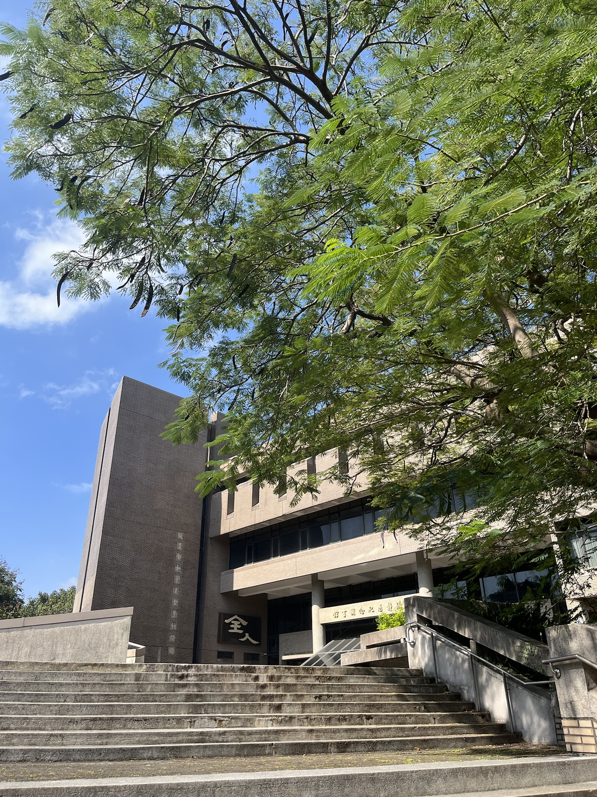

今天天氣好好啊！！

今天一早就到圖書館報到，因為下禮拜考計算機網路 0.0
中午吃我很愛的中原附近的早午餐店-元氣小豬。

一進門，

老闆：「你要外帶吼？」

老闆娘：「他不要蛋，幫他改起司！」鏗強有力，不拖泥帶水地說。

。。。

我笑著回答說：「對，謝謝xd」

覺得老闆娘很可愛，我這個學期常常去吃元氣小豬，一個星期少說吃兩次（這是一星期基本低消，偶爾超過）

老闆娘一開始還問我說：「蛋這麼好吃，你不吃喔？」

因為我都懶得解釋，所以我都講說，我不能吃蛋。

其實我只吃一整顆圓的蛋，荷包蛋那種我吃了會想吐。

為什麼呢？ 我也不知道xd

 

所以如果有早餐店 d4 不給蛋的，或是願意讓我換其他的，我都會很愛吃，中原的元氣小豬是之一，而且很好吃、又便宜！

